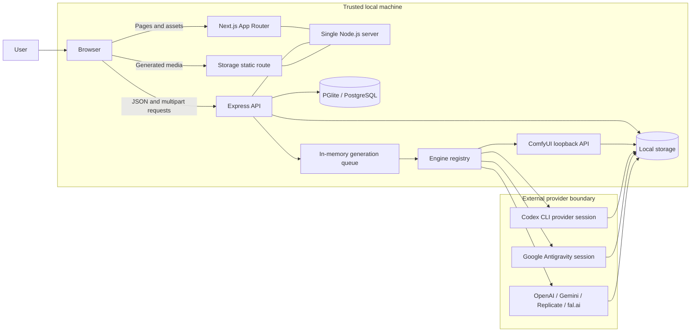
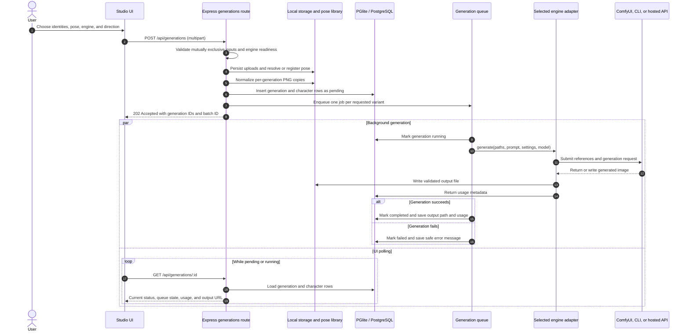
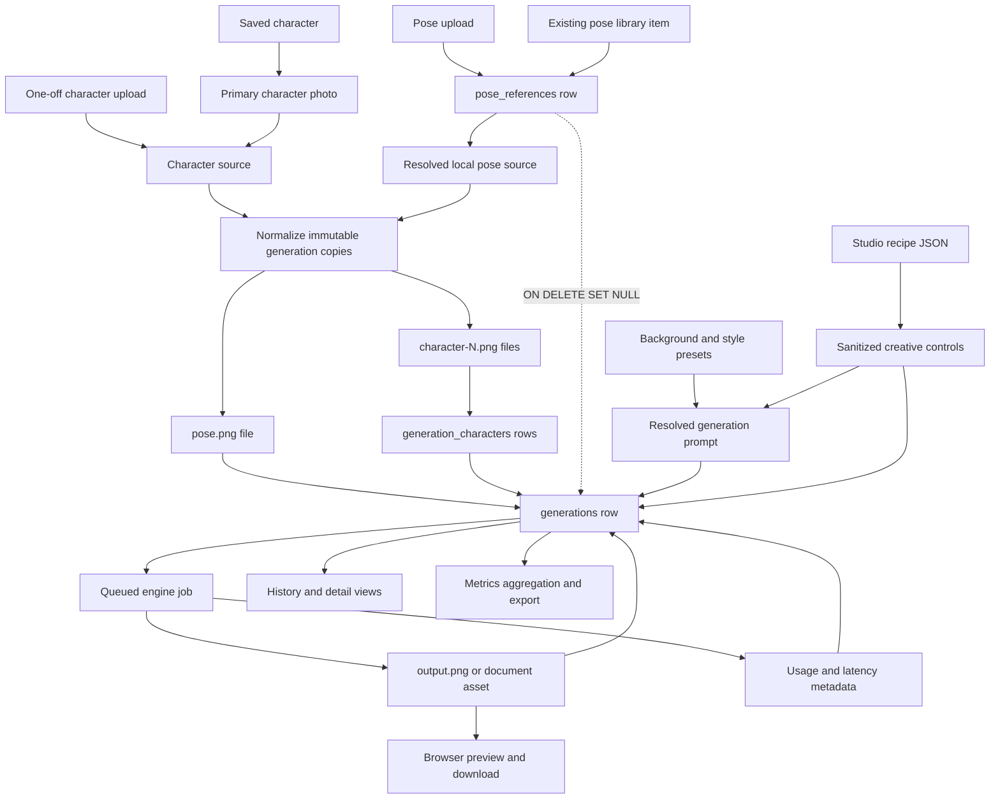

# Architecture

This document describes how PoseForge is put together — useful background
before contributing, especially if you're adding a new generation engine or
touching the data model.

## Stack

PoseForge runs as one Node.js process. `server.js` prepares Next.js, mounts the
Express routes and local storage on the same application, and delegates every
remaining request to the Next.js handler.

| Surface | Path | Owns |
|---|---|---|
| Express | `/api/*`, `/storage/*` | JSON API, generation queue, engine adapters, and file storage |
| Next.js (`web/`) | All page and asset routes | The entire user interface |

The UI holds no business logic. Every rule about what makes a valid
generation is enforced in the Express layer; the React app mirrors a few of
those rules only to give faster feedback, never to replace them. That
boundary is what lets the API be exercised directly with `curl` while keeping
the API and UI testable in isolation.

| Layer | Choice | Why |
|---|---|---|
| Runtime | Node.js 20.9+ | No framework lock-in, easy to run anywhere |
| API framework | Express | Small surface area, well understood |
| Database | Embedded PGlite by default; PostgreSQL optional | PostgreSQL semantics without requiring a local database server |
| Migrations | Plain `.sql` files, custom runner | No ORM needed at this schema size — see `db/migrate.js` |
| File storage | Local filesystem under `storage/` | The database stores paths and metadata only, never image bytes |
| UI framework | Next.js 16 (App Router) + React 19 | Server components for static shells, client components for the workbench |
| Styling | Tailwind CSS 4 with CSS-first `@theme` | One token source shared by utilities and hand-written component CSS |
| Components | Radix primitives + CVA variants | Accessible behaviour by default; variants stay declarative and typed |
| Data fetching | TanStack Query | Caching, polling with backoff, and consistent error/loading states |
| Documentation | Fumadocs, served at `/docs` | The repo's own markdown, rendered in the app |
| Generation engines | Pluggable adapters behind a common interface | See below — this is the project's main extension point |

## System architecture



The browser sees one origin. Express routes are mounted before the Next.js
catch-all handler, so `/api/*` and `/storage/*` stay in the backend while page
and asset requests fall through to Next.js. PGlite holds relational state and
file paths by default; users can select an existing PostgreSQL server through
`.env`. Image bytes remain under `storage/`. The provider boundary is
selected per generation: loopback ComfyUI can remain entirely local, while
signed-in CLIs and hosted APIs transmit the selected inputs to their provider.

## Directory layout

```
server.js                 Single server entry point: Express routes + Next handler
db/
  pool.js                 PGlite/PostgreSQL adapter selected from .env
  migrate.js               Runs pending .sql files in db/migrations, tracked in schema_migrations
  migrations/               001_init.sql (schema), 002/003_*_seed.sql (starter presets),
                             004_pose_references.sql (pose library schema),
                             005_pose_references_seed.sql (starter poses),
                             006_generation_characters.sql (up to 4 people per generation),
                             008_advanced_studio.sql (recipes, creative settings, batches)
routes/
  characters.js, generations.js, presets.js, engines.js, settings.js, pose-references.js
engines/
  index.js                 Registry: engine key -> adapter module
  engineInterface.md        The adapter contract, documented
  codexEngine.js, antigravityEngine.js, comfyEngine.js, openaiEngine.js,
  geminiEngine.js, replicateEngine.js, falEngine.js
lib/
  promptTemplate.js         Builds the merge instruction sent to an engine
  storage.js                 Centralized, path-traversal-safe file path helpers
  generationQueue.js         In-memory FIFO single-flight job queue
  imageNormalizer.js         Normalizes uploads to PNG before generation
  logger.js                  Structured JSON request/event logging
  poseLibrary.js             Persists/resolves pose reference images (see below)
  poseTagger.js               Best-effort AI auto-tagging for pose references
  metricsAggregator.js       Pure rollups for the Metrics dashboard
public/
  images/                    Brand assets the UI links to; no HTML is served here
web/                        The Next.js application — see "Frontend" below
scripts/
  generate-mascot.js         One-off Codex CLI call that produces the mascot artwork
storage/                    Runtime data plus tracked pose-library/seed starter assets
```

### Inside `web/`

```
app/
  layout.tsx                 Root layout, fonts, providers
  providers.tsx              TanStack Query, next-themes, tooltips, toasts
  page.tsx                   Landing
  studio/                    The workbench (page.tsx, studio-view.tsx, studio.css)
  characters/ poses/ passport/ history/ metrics/ settings/
  docs/[[...slug]]/          Fumadocs renderer
components/
  ui/                        Radix + CVA primitives shared across pages
  layout/                    Nav, footer, page shell
  studio/                    Workbench panels (sources, canvas, inspector, dock)
  metrics/                   KPI cards, trend chart, engine table
lib/
  api/client.ts              Typed fetch wrapper; every response shape lives here
  api/hooks.ts               One hook per resource, plus polling helpers
  studio/reducer.ts          Studio state machine, validation, form serialization
  studio/settings.ts         Mirror of lib/studioSettings.js option lists
tests/                       Vitest + Testing Library + MSW
e2e/                         Playwright specs
content/docs/                MDX sourced from the repo's own markdown
```

## Data model

Eight product tables, no ORM:

- **`characters`** — a saved identity (name + timestamps).
- **`character_photos`** — one or more reference photos per character, one
  flagged `is_primary`.
- **`presets`** — background/style presets. Each has a `prompt_fragment`
  appended into the generation prompt when selected. `is_custom` marks
  user-added presets versus the seeded starter set.
- **`settings`** — flat key/value store for the default engine, provider
  credentials, selected models, and the optional ComfyUI workflow. Values
  configured through Settings are deliberately local database values rather
  than environment variables — see `SECURITY.md` and `PRIVACY.md`.
- **`generations`** — one row per generation attempt. Tracks `status`
  (`pending` → `running` → `completed`/`failed`), the resolved prompt, and
  paths to the pose photo and output. `pose_reference_id` uses `ON DELETE
  SET NULL`, so deleting a pose reference never deletes generation
  history. The legacy `character_id`/`character_photo_id` columns are
  still present (nullable, unused by new rows) so pre-migration
  generations still resolve their single character — every new generation
  is written through `generation_characters` instead.
- **`generation_characters`** — one row per person in a generation (1-4,
  `position` 1-4, `UNIQUE (generation_id, position)`). Each points at
  either a saved `character_id` (`ON DELETE SET NULL` — deleting a
  character never deletes past generations) or is null when that slot was
  a one-off upload; either way `file_path` always has the normalized copy
  actually used. Deleting a generation cascades and removes its rows here.
- **`pose_references`** — the pose library shown in the Gallery and picked
  from in Studio. Either seeded (curated Pexels photos, `is_custom: false`,
  hotlinked via `source_url` until first used) or user-added (`is_custom:
  true`, always has a local `file_path`). `tag_status` (`pending` →
  `tagged`/`skipped`) tracks the best-effort AI auto-tagging pipeline —
  see below.
- **`studio_recipes`** — named, reusable Advanced-mode settings stored as
  JSONB. Recipes contain creative controls only; they never retain identity
  or pose images.
- **`studio_projects`** — the versioned, persistent Studio canvas document.
  It stores viewport, node geometry, edges, and lock state in validated JSONB,
  with an optimistic `revision` that prevents one browser tab from silently
  overwriting another. The local-first app creates one default project on
  first use; the schema supports additional named projects later.
- **`studio_composition_revisions`** — immutable, per-node snapshots reserved
  for the Forge-owned settings phase. Existing canvas persistence does not
  write revisions until a generation run is submitted.
- **`studio_runs`** — durable run lineage between an immutable composition
  revision and one or more generation rows. Its nullable foreign keys on
  `generations` preserve backward compatibility with pre-project history.

Advanced generations also store `studio_mode`, sanitized `advanced_settings`
JSONB, and an optional `batch_id` that groups multi-variant requests.

The Studio client serializes project saves: each request uses the last
acknowledged revision, and newer canvas gestures coalesce behind an in-flight
save. React Flow remains the interaction renderer, while the project document
is the durable source of viewport, positions, edges, and lock state. Source
and result data are still reconciled from the current generation form until
the per-node configuration migration is complete.

Run `npm run migrate` to apply `db/migrations/*.sql` in order; it tracks
what's already applied in a `schema_migrations` table, so it's safe to run
repeatedly.

## The engine adapter pattern

This is the part most contributions touch. Every generation engine —
Codex CLI, Antigravity CLI, OpenAI, Gemini, ComfyUI, Replicate, or a future one — implements
the same shape:

```js
{
  key: "engine-key",
  label: "Human-readable name",
  models: [{ id: "provider-model-id", label: "Model name" }], // optional
  async getConfiguredModel() {}, // optional
  async isReady() {
    // return { ready: true } or { ready: false, reason: "..." }
  },
  async generate({ characterPhotoPaths, posePhotoPath, prompt, outputPath, outputSettings, apiKey, model }) {
    // write a PNG to outputPath, or throw an Error with a clear message
  },
}
```

`characterPhotoPaths` is an array of 1-4 local paths — one per person in
the generation (dad, mom, kid, ...), in the same order the prompt text
refers to them by ("Image 1", "Image 2", ...). Every adapter needs to
forward all of them, not just the first — `codexEngine.js` adds one `-i`
flag per path, `openaiEngine.js` adds one `image[]` entry per path (both
straightforward since their underlying APIs already accept multiple
images). `replicateEngine.js` is the interesting case: the
`flux-kontext-pro` model's schema only accepts a single `input_image`, so
with more than one character photo it composites them into a side-by-side
montage locally (via `sharp`) before sending — an imperfect but reasonable
fallback, documented inline in that file.

`engines/index.js` holds the registry (`{ codex, antigravity, openai, gemini, comfy, replicate, fal }`) and
`listEngines()`, which calls `isReady()` on each — that's what powers both
the Studio's engine dropdown and the Settings screen's status list. The
registry is enough for basic discovery; engines with provider-specific
credentials, models, or workflow settings also need corresponding Settings
fields. See `CONTRIBUTING.md` for the walkthrough.

Adapters worth knowing about specifically:

- **`codexEngine.js`** shells out to the Codex CLI (`codex exec --sandbox
  workspace-write --skip-git-repo-check --ephemeral ...`), passing the two
  reference images directly via `-i` flags rather than embedding file paths
  in the prompt text. No API key required — readiness is just "is the
  binary on PATH."
- **`openaiEngine.js`** and **`replicateEngine.js`** call their respective
  HTTP APIs directly using a key read from the `settings` table.
- **`geminiEngine.js`** sends up to five inline reference images to the
  configured Gemini image model and records provider token metadata plus a
  dated rough per-output cost.
- **`comfyEngine.js`** connects only to loopback by default, uploads the
  references to ComfyUI, renders a user-supplied API workflow template,
  polls its history endpoint, and downloads the first saved output image.
  Its workflow placeholder contract is implemented in `lib/comfyWorkflow.js`.
- **`antigravityEngine.js`** invokes Google’s local `agy` binary in documented
  headless JSON mode. It confines each run to the generation folder with
  `--sandbox`, auto-approves otherwise-unpromptable headless tool calls inside
  that isolated folder, uses cached interactive credentials, and records
  CLI-reported input, output, and thinking tokens. Antigravity's native image
  tool currently stages output in its per-conversation `brain` directory even
  when asked for a workspace path; the adapter validates the returned file URL,
  conversation ID, directory boundary, size, and PNG signature before copying
  that artifact into PoseForge storage.

## Generation call flow



The HTTP request does not wait for image generation:

1. `POST /api/generations` validates input, persists the uploaded pose
   photo, resolves the character photo, builds the prompt (base
   instructions + any preset fragments), inserts a `generations` row with
   `status: 'pending'`, and calls `lib/generationQueue.js`'s `enqueue()`.
   It responds `202` immediately — it does not wait for generation to finish.
2. The queue (`lib/generationQueue.js`) is an in-memory FIFO array. It starts
   up to `GENERATION_CONCURRENCY` jobs at once, clamped to 1-6 and defaulting
   to 6. A multi-variant request creates one independently tracked job per
   variant.
3. When a job runs: update the row to `running`, call the selected engine's
   `generate()`, then update to `completed` (with `output_path`) or
   `failed` (with `error_message`).
4. The frontend polls `GET /api/generations/:id` every ~1.5s until the
   status leaves `pending`/`running`.

Known limitation: the queue is in-memory only. A server restart mid-job leaves
that row stuck in `running` — acceptable for a local single-user tool, but
worth knowing if you're debugging a "stuck" generation.

## Object and data flow



The durable object is the `generations` row, not the transient upload. Every
run receives normalized character and pose copies under its own generation
directory, so history remains reproducible even if a saved character or pose
library entry is later deleted. Foreign keys use `ON DELETE SET NULL` where
history must survive, while deleting the generation cascades its
`generation_characters` rows and the route removes its files.

## The pose library

Every pose a generation could use — seeded starters and anything a user
uploads — lives in `pose_references`. There is deliberately no separate
"save this pose" step: `POST /api/generations` with a raw `posePhoto`
upload registers that photo as a new library entry (via
`lib/poseLibrary.js#addPoseReference`) before using it, so a pose is never
usable without also being reusable. The alternative is `poseReferenceId`,
which points at an existing entry.

Two things `lib/poseLibrary.js` handles that are easy to miss:

- **Bundled starters and lazy caching.** A representative offline starter
  set ships under `storage/pose-library/seed/`; the remaining seed rows use
  a `source_url` (hotlinked, same pattern as the Gallery showcase photos —
  see `CREDITS.md`). `resolvePoseReferenceFile()` — called when a remote pose
  is first used in a generation — caches it under `storage/pose-library/`,
  after which `file_path` is set and it's served locally from then on.
- **Best-effort AI tagging, always in the background.** `lib/poseTagger.js`
  tries OpenAI's vision-capable chat completions API first (if a key is
  configured in `settings`), falls back to asking the Codex CLI to inspect
  the image and write a small JSON tag object, and returns `null` if
  neither is available. `tagPoseReferenceInBackground()` fires this off
  without being awaited by the request handler — a pose upload or
  generation never waits on tagging, and a `pending`/`tagged`/`skipped`
  `tag_status` lets the UI show a small "tagging…" indicator that clears
  once (if) real tags land.

## Storage

`lib/storage.js` centralizes every filesystem path the app touches
(`getCharacterPhotoPath`, `getGenerationPosePath`, `getGenerationOutputPath`,
etc.) and validates that resolved paths stay inside `storage/` — nothing
else in the codebase should build a `storage/` path by hand. `server.js`
serves `storage/` read-only at `/storage`.

## Frontend

The UI lives entirely in `web/` as a Next.js App Router application.

**Design tokens.** `app/globals.css` declares every colour, radius, shadow
and font as a `--pf-*` custom property, with a `.dark` block overriding the
palette. Tailwind's `@theme` maps those onto utility classes, so a utility
and a hand-written rule always resolve to the same value. Adding a colour
means adding it in one place.

**Components.** `components/ui/` wraps Radix primitives with Class Variance
Authority variants. Radix supplies focus trapping, roving tabindex, and ARIA
wiring; CVA keeps the variant matrix typed and declarative. Nothing in the
app should hand-roll a dialog, select, or toggle group.

**Data.** `lib/api/client.ts` is the only place that calls `fetch`. It
throws a typed `ApiError` carrying the HTTP status, so callers branch on
`isNotFound` / `isConflict` instead of matching message strings.
`lib/api/hooks.ts` wraps that in TanStack Query — one hook per resource,
plus `useGenerationsPolling`, which polls a batch of in-flight generations
with a backoff that widens as a run ages.

**Studio.** The workbench is the one screen complex enough to need its own
state machine. `lib/studio/reducer.ts` owns it: slot management, the
mutually-exclusive rules (a subject is *either* a saved character *or* an
upload; a pose is *either* an upload *or* a library reference), validation
mirroring the server's acceptance rules, and multipart serialization. The
reducer is a pure function, so the whole interaction model is unit tested
without rendering anything.

Its layout is deliberate: `web/app/studio/studio.css` is plain CSS rather
than utility classes. The three-column workbench has enough precise sizing
that a stylesheet reads better than a wall of arbitrary values — it still
resolves through the same `--pf-*` tokens as everything else.

**Testing.** Vitest with Testing Library and MSW covers components and
hooks; Playwright covers the flows end to end. See `CONTRIBUTING.md`.

## What we'd want before a 1.0

- Recovery for generations stuck in `running` after a restart.
- An opt-in auth layer, if PoseForge is ever meant to run somewhere other
  than localhost (see `SECURITY.md`).
- Persisted metrics rollups, so the dashboard does not re-aggregate the
  whole `generations` table on every request.
