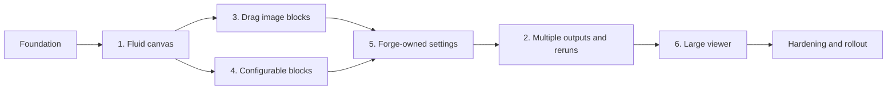

# PoseForge Fluid Studio — Implementation Task Plan

**Status:** Ready for engineering refinement  
**Source:** `PRD-PoseForge-Fluid-Studio.md`  
**Prepared:** August 17, 2026  
**Planning method:** Dependency-first delivery, feature flags, incremental release gates

---

## 1. Purpose

This plan turns the Fluid Studio PRD into an ordered engineering backlog. It is designed so the team can implement and validate one capability at a time without creating a second temporary architecture that must later be discarded.

The six requested features remain individually traceable, but the recommended delivery order differs from their original numbering because **Feature 5, node-owned Forge Composition settings, is a prerequisite for trustworthy Generate Again behavior in Feature 2**.

### Recommended implementation order

- [x] Foundation — persistent Studio Project and delivery controls
- [x] Feature 1 — fluid canvas
- [x] Feature 3 — drag and add image blocks
- [x] Feature 4 — configurable blocks
- [ ] Feature 5 — Forge Composition owns Normal and Advanced settings
- [ ] Feature 2 — multiple outputs and Generate Again
- [ ] Feature 6 — large generated-image viewer
- [ ] Hardening and controlled rollout

### Completed implementation notes

Foundation and Fluid Canvas were implemented on August 17, 2026:

- Added the versioned `studio_projects` document, immutable composition-revision and run-lineage foundation, and backward-compatible generation lineage fields.
- Added default-project create/load/update/archive APIs, document validation, size limits, feature flag, optimistic revision conflicts, and a serialized client save queue.
- Made React Flow geometry durable: viewport, node positions, edges, and lock state now restore from the saved project.
- Removed reactive Fit View calls from node, source, selection, generation, and Result updates. Fit now occurs on initial canvas mount or explicit Fit/Tidy actions.
- Added Saved, Saving, loading, retry, and conflict feedback.
- Preserved pan, zoom, selection, and inspection while the canvas is locked; mutation gestures remain disabled.
- Expanded canvas snapshots to preserve positions, edges, and viewport for undo/redo and made Tidy an undoable saved action.
- Kept the full canvas palette on semantic day/night tokens and added theme-correct save-state styling.
- Added schema, route, migration, hydration, save, lock, and camera-stability tests; verified the production build.

Undo/redo now includes add/remove/resize/collapse commands through the shared persistence and history boundary established by the Fluid Canvas work.

Features 3 and 4 were completed on August 18, 2026:

- Added drag, click, and keyboard creation for Character and Pose image blocks with projected drop coordinates, visible drop-state feedback, strict source-type validation, recoverable empty states, and in-Studio selection from uploads, libraries, suggestions, and generated history.
- Added a selected-source inspector with preview, source metadata, Fit/Fill controls, asset-location links, replace, disconnect, and remove actions.
- Added privacy-safe, page-local source funnel events for drawer start, add success, picker source, validation failures, upload outcomes, asset selection, and time-to-populated-block. No event is persisted or transmitted.
- Added constrained pointer resizing and keyboard-operable presets, collapse/expand, rename, duplicate, reset, Fit/Fill, disconnect, remove, undo/redo, measured Tidy, durable geometry, and lock-aware actions.
- Added compact Forge summaries for mode, engine, input count, output count, aspect ratio, validation, and run state.
- Added component and browser coverage for non-default camera drops, source inspection, invalid drops, local events, min/max sizing, collapse ports, locked actions, persistence, theme inversion, and first-open edge rendering.



Feature 6 can begin after the Result data contract is stable, but its final Generate Again and Use as input actions depend on Feature 2.

---

## 2. Planning assumptions and capacity

No team roster, availability, or three-sprint velocity history was provided. The estimates below are relative story points for sequencing and refinement, not calendar commitments.

### Provisional capacity model

Use this model only until actual team data is available:

- Sprint duration: 2 weeks.
- Example delivery team: 2 web/full-stack engineers, 1 backend engineer, part-time designer, part-time QA.
- Example historical velocity assumption: 36–40 points per sprint.
- Required buffer: 20% for bugs, support, review, and technical debt.
- Provisional committed capacity: 29–32 points per sprint.
- Do not commit more than one high-risk data-model or interaction story to the same engineer simultaneously.

### Capacity calculation to complete during sprint planning

```text
Average velocity = mean(completed points in last 3 sprints)
Availability factor = available engineering days / normal engineering days
Gross capacity = average velocity × availability factor
Committed capacity = gross capacity × 0.80
```

### Provisional sprint-plan summary

```text
Sprint Goal: Deliver one independently testable Fluid Studio capability behind a feature flag.
Duration: 2 weeks
Team Capacity: 29–32 points, provisional until roster and velocity are supplied
Committed Stories: Select highest-priority Ready stories up to capacity
Buffer: 20% reserved for defects, review, support, and technical debt
```

The full backlog is currently estimated at approximately 400 points before team refinement, or roughly 13–15 provisional sprints at the example capacity. This includes persistence, migrations, tests, accessibility, analytics, and rollout work—not only visible UI changes. Refinement should split or re-estimate the 8-point stories before commitment where uncertainty remains high.

---

## 3. Working agreements

### Definition of Ready

A task can enter a sprint only when:

- [ ] User behavior and acceptance criteria are clear.
- [ ] Design states exist for default, hover, selected, focused, disabled, loading, empty, error, locked, day, and night modes where applicable.
- [ ] API and data ownership are agreed.
- [ ] Dependencies are completed or scheduled with a named owner.
- [ ] Analytics and accessibility impact are identified.
- [ ] Story is estimated by the implementing team.
- [ ] No unresolved product decision can materially change the implementation.

### Definition of Done

A task is done only when:

- [ ] Production code and migrations are reviewed.
- [ ] Unit/integration coverage is added or updated.
- [ ] Relevant end-to-end journey passes.
- [ ] Keyboard and screen-reader behavior is verified for new controls.
- [ ] Day and night visual states are verified.
- [ ] Analytics events contain no prompt text, image content, or private asset URLs.
- [ ] Error, loading, empty, and retry states are implemented.
- [ ] Feature-flag and rollback behavior is tested.
- [ ] Documentation and support notes are updated where user behavior changes.

### Estimation key

| Points | Typical meaning |
|---:|---|
| 1 | Trivial, known change |
| 2 | Small, low-risk task |
| 3 | Focused story with tests |
| 5 | Multi-file behavior or moderate uncertainty |
| 8 | Cross-layer story or high uncertainty; consider splitting during refinement |
| 13 | Too large for commitment; must be split |

---

## 4. Foundation — Persistent Studio Project

### Goal

Create the durable project, revision, and feature-flag foundation required by every canvas feature without changing the existing user experience prematurely.

### Sprint goal

PoseForge can create, save, load, and version a Studio Project behind a feature flag while legacy Studio and History remain functional.

### Task checklist

#### Product and design decisions

- [ ] **FND-01 — Resolve blocking product decisions** — 3 points — Product/Design  
  Decide default project lifecycle, Normal/Advanced output-count caps, multiple-pose behavior, result retention, auto-connect behavior, and credit confirmation thresholds.  
  **Depends on:** none.

- [ ] **FND-02 — Finalize semantic Studio token map** — 3 points — Design/Web  
  Define day and night tokens for pane, dots, nodes, controls, drawer, text, border, handle, edge, hover, selected, focused, disabled, success, warning, and failure. Include the neutral image-viewing surface.  
  **Depends on:** none.

#### Data and API

- [ ] **FND-03 — Define versioned Studio Project schemas** — 5 points — Backend/Web  
  Specify runtime-validated shapes for projects, nodes, edges, viewport, Forge configuration, composition revisions, runs, and Result references. Include schema-version and migration contracts.  
  **Depends on:** FND-01.

- [ ] **FND-04 — Add project and lineage database migration** — 8 points — Backend  
  Add project, node/document, edge, composition revision, and run storage; add nullable lineage fields to existing generations. Preserve all current generation queries.  
  **Depends on:** FND-03.

- [ ] **FND-05 — Implement Studio Project CRUD and revision API** — 8 points — Backend  
  Create/fetch/update/archive projects with ownership checks, optimistic document revision, idempotent writes, typed validation, and explicit conflict responses.  
  **Depends on:** FND-04.

- [ ] **FND-06 — Add default-project bootstrap and legacy compatibility** — 5 points — Backend/Web  
  Create a default project on first new-Studio open. Keep current generation History accessible. Represent imported legacy generations without claiming missing settings are reproducible.  
  **Depends on:** FND-05.

#### Delivery controls

- [ ] **FND-07 — Add server-controlled Fluid Studio feature flag** — 2 points — Web/Backend  
  Support internal, opt-in, percentage, and off cohorts. Confirm legacy route remains available during rollout.  
  **Depends on:** none.

- [ ] **FND-08 — Add persistence and migration observability** — 3 points — Backend/Analytics  
  Track project load/save duration, save conflicts, failed migrations, schema versions, and project hydration errors.  
  **Depends on:** FND-05.

- [ ] **FND-09 — Add schema and authorization test suite** — 5 points — QA/Backend  
  Cover ownership boundaries, optimistic conflicts, deterministic schema migration, malformed node data, idempotency, legacy rows, and rollback compatibility.  
  **Depends on:** FND-04, FND-05, FND-06.

### Foundation acceptance gate

- [ ] A signed-in user can create, save, fetch, and update only their project.
- [ ] A stale revision receives a conflict rather than silently overwriting newer data.
- [ ] Existing generation History and downloads pass regression tests.
- [ ] Schema migration is deterministic and non-destructive.
- [ ] The feature flag can disable the new Studio UI without deleting project or generation data.

### Risks

- **Risk:** JSON project state becomes impossible to query or migrate.  
  **Mitigation:** Keep runs and generation lineage normalized; validate and version any document payload.
- **Risk:** Existing generation routes regress.  
  **Mitigation:** Add nullable fields first and run old/new API suites throughout rollout.

---

## 5. Feature 1 — Make Studio More Fluid

### Goal

Make the canvas responsive, stable, persistent, theme-correct, and recoverable before adding more node behaviors.

### Sprint goal

Users can move through and arrange the Studio without unexpected camera movement, and their layout returns after reload.

### Primary files

- `web/app/studio/studio-view.tsx`
- `web/components/studio/canvas.tsx`
- `web/app/studio/studio.css`
- `web/lib/studio/reducer.ts`
- Studio API client and hooks

### Task checklist

#### Canvas state and persistence

- [ ] **FLD-01 — Separate persistent graph state from derived form layout** — 8 points — Web  
  Make project nodes/edges authoritative. Remove position rebuilding from ordinary prop changes. Provide a migration adapter for the current single Character/Pose/Generate view.  
  **Depends on:** FND-03, FND-05.

- [ ] **FLD-02 — Persist viewport and node positions** — 5 points — Web  
  Save and restore x/y, zoom, and node positions. Debounce continuous drag/pan mutations and preserve local optimistic state while saving.  
  **Depends on:** FLD-01.

- [ ] **FLD-03 — Stabilize Fit View behavior** — 3 points — Web  
  Fit only on initial hydrated open, explicit Fit, or explicit Tidy. Selection, source changes, run status, and result completion must not move the camera. Account for drawer and inspector obstruction.  
  **Depends on:** FLD-01.

- [ ] **FLD-04 — Implement save-state feedback and retry** — 5 points — Web/Backend  
  Show Saving, Saved, Retrying/Offline, Save failed, and Conflict states. Never show Saved before server acknowledgement. Preserve local state during retry.  
  **Depends on:** FND-05, FLD-02.

#### Controls and interaction history

- [ ] **FLD-05 — Complete lock semantics** — 3 points — Web  
  Lock blocks move, resize, add/drop, delete, connect, and disconnect while allowing pan, zoom, selection, inspection, and image viewing.  
  **Depends on:** FLD-01.

- [ ] **FLD-06 — Expand undo/redo command history** — 8 points — Web  
  Cover add, remove, move, resize, collapse, edge changes, rename, and settings changes. Do not undo submitted generation jobs. Bound history memory and clear/rehydrate intentionally.  
  **Depends on:** FLD-01.

- [ ] **FLD-07 — Implement measured Tidy layout** — 5 points — Web  
  Use Dagre or ELK with measured node sizes. Tidy selection when present, otherwise all. Preserve vertical graph direction and make the action one undoable command.  
  **Depends on:** FLD-06; fully validated again after Feature 4.

#### Theme and accessibility

- [ ] **FLD-08 — Replace canvas hard-coded colors with semantic tokens** — 5 points — Web/Design  
  Apply the approved tokens to canvas, dot grid, nodes, controls, handles, edges, drawer, selection, focus, status, and disabled states in day and night themes.  
  **Depends on:** FND-02.

- [ ] **FLD-09 — Add keyboard canvas navigation and reduced motion** — 5 points — Web/QA  
  Provide focus movement, select, inspect, action menu, delete/recover, Fit, lock, and non-pointer alternatives. Disable nonessential animation under reduced motion.  
  **Depends on:** FLD-01.

#### Verification

- [ ] **FLD-10 — Add fluid-canvas integration and performance tests** — 5 points — QA/Web  
  Cover reload restoration, save retry, camera stability, lock, undo/redo, day/night snapshots, and 10/30/100-node performance fixtures.  
  **Depends on:** FLD-02 through FLD-09.

- [ ] **FLD-11 — Instrument canvas interaction quality** — 3 points — Analytics/Web  
  Capture project open, save failure, Fit, Tidy, lock, undo/redo, interaction latency, visible-node count, and theme changes without logging image content.  
  **Depends on:** FLD-01, FND-08.

### Feature 1 acceptance gate

- [ ] Reload restores node positions and viewport after Saved appears.
- [ ] Result or source state changes do not move the camera.
- [ ] Lock prevents mutations but still permits inspection, pan, and zoom.
- [ ] Undo/redo restores supported visual mutations without canceling server work.
- [ ] Day and night themes have no stale hard-coded surfaces or invisible states.
- [ ] A representative 30-node canvas reaches the PRD interaction budget.

### Risks

- **Risk:** The current global reducer and React Flow both become sources of truth.  
  **Mitigation:** Project graph owns persistent state; React Flow is a controlled view; adapters are temporary and explicitly removed.
- **Risk:** Saving every pointer event overloads the API.  
  **Mitigation:** Optimistic local updates plus debounced/coalesced geometry mutations.

---

## 6. Feature 3 — Drag and Add an Image Block

### Goal

Let users add a real Character or Pose image block from the bottom drawer at the intended canvas position and choose its source without leaving Studio.

### Sprint goal

A user can drag or keyboard-add an image block, populate it from an approved source, and reload the project without losing it.

### Primary files

- `web/components/studio/dock.tsx`
- `web/components/studio/canvas.tsx`
- `web/components/studio/inspector.tsx`
- `web/app/studio/studio-view.tsx`
- `web/lib/api/client.ts`
- Pose reference and asset routes

### Task checklist

#### Drawer and drop behavior

- [x] **IMG-01 — Define drawer payload and source-node contract** — 3 points — Web/Backend  
  Define Character and Pose source types, asset references, empty state, labels, preview metadata, and stable IDs.  
  **Depends on:** FND-03, FLD-01.

- [x] **IMG-02 — Implement draggable drawer cards and ghost state** — 5 points — Web/Design  
  Add Character Image and Pose Image cards, drag ghost, valid/invalid drop indication, locked state, and Escape cancellation.  
  **Depends on:** IMG-01, FLD-05.

- [x] **IMG-03 — Create node at projected canvas coordinates** — 5 points — Web  
  Convert pointer screen coordinates using current pan/zoom, create the node once, adjust only to keep it reachable, and persist the exact position.  
  **Depends on:** IMG-02, FLD-02.

- [x] **IMG-04 — Add click and keyboard alternative** — 3 points — Web  
  Enter/click creates a block in the unobscured viewport center, selects it, and starts the same source-selection flow as drag/drop.  
  **Depends on:** IMG-02.

#### Image selection

- [x] **IMG-05 — Build in-Studio image picker state** — 8 points — Web/Design  
  Support Upload, existing Characters, existing Poses, suggestions, and generated/history assets where valid. Preserve an explicit empty block when the chooser is dismissed.  
  **Depends on:** IMG-01; asset endpoints must be available.

- [x] **IMG-06 — Implement upload and asset validation** — 5 points — Web/Backend  
  Validate content type, extension, configured size/dimensions, corruption, ownership, upload failure, and duplicate reuse. Keep the block recoverable on failure.  
  **Depends on:** IMG-05.

- [x] **IMG-07 — Populate or replace source without geometry changes** — 3 points — Web  
  Assign the asset, update preview/metadata/handle, and autosave without changing position, dimensions, or valid connections.  
  **Depends on:** IMG-05, FLD-04.

- [x] **IMG-08 — Implement source-node inspector** — 5 points — Web  
  Add Select/Replace image, source type, preview mode, metadata, locate asset, disconnect, and remove-from-canvas actions.  
  **Depends on:** IMG-05, IMG-07.

#### Verification

- [x] **IMG-09 — Add drag/picker accessibility and end-to-end tests** — 5 points — QA/Web  
  Cover non-default zoom/pan, locked drop, canceled picker, rejected upload, keyboard add, replace without movement, reload, and both themes.  
  **Depends on:** IMG-02 through IMG-08.

- [x] **IMG-10 — Instrument source-add funnel** — 2 points — Analytics/Web  
  Capture drawer start, drop/click success, block type, picker source, validation failure, asset selection, and time to populated block.  
  **Depends on:** IMG-03, IMG-05.

### Feature 3 acceptance gate

- [x] A drop at non-default pan and zoom appears under the pointer in canvas coordinates.
- [x] A new node remains where placed after image selection and reload.
- [x] Upload, library, suggestion, and generated/history entry points enforce ownership and type rules.
- [x] Cancel and recoverable errors leave a clear, usable empty block.
- [x] Locked canvas rejects drop without creating hidden or duplicate state.
- [x] Keyboard users can complete the same add-and-select journey.

### Risks

- **Risk:** Drawer assets and canvas nodes use incompatible IDs.  
  **Mitigation:** Drawer payload references durable asset IDs; node ID is separate from asset ID.
- **Risk:** One drop creates duplicate nodes due to overlapping events.  
  **Mitigation:** Use one canonical drop handler and idempotent client mutation ID.

---

## 7. Feature 4 — Make Blocks Configurable

### Goal

Replace rigid boxes with safe, type-aware resizing, collapsing, and content configuration while keeping the canvas tidy and accessible.

### Sprint goal

Users can resize, collapse, rename, duplicate, and restore blocks without breaking their content, ports, edges, or saved layout.

### Primary files

- `web/components/studio/canvas.tsx`
- Studio node components and CSS
- `web/components/studio/inspector.tsx`
- Project schema and reducer/actions

### Task checklist

#### Shared configuration framework

- [x] **BOX-01 — Define type-specific geometry constraints** — 3 points — Design/Web  
  Approve default/min/max dimensions and responsive content breakpoints for Character, Pose, Forge Composition, and Result blocks.  
  **Depends on:** FND-01.

- [x] **BOX-02 — Add persisted dimensions and collapsed state** — 5 points — Web/Backend  
  Extend typed node data and project mutations with width, height, collapsed state, last-expanded size, and image fit mode.  
  **Depends on:** FND-03, FLD-02, BOX-01.

- [x] **BOX-03 — Implement selected-state resize controls** — 8 points — Web  
  Add React Flow resize handles with type limits, live feedback, one history command per gesture, lock support, and debounced persistence.  
  **Depends on:** BOX-02, FLD-05, FLD-06.

- [x] **BOX-04 — Implement collapse and expand** — 5 points — Web  
  Collapse to accessible header/tab, retain ports and status meaning, restore last dimensions, and persist behavior.  
  **Depends on:** BOX-02.

- [x] **BOX-05 — Add shared block action menu** — 5 points — Web/Design  
  Provide Rename, Duplicate, Reset size, Collapse/Expand, Disconnect where valid, Remove from canvas, and permanent-delete routing where allowed.  
  **Depends on:** BOX-02, FLD-06.

#### Type-specific content

- [x] **BOX-06 — Add source image Fit/Fill behavior** — 3 points — Web  
  Reflow previews at supported widths and preserve the source asset. Label frame behavior clearly; do not imply destructive cropping.  
  **Depends on:** BOX-03, IMG-07.

- [x] **BOX-07 — Add Result aspect-aware resizing** — 5 points — Web  
  Preserve intrinsic aspect by default, use responsive thumbnails, and keep high-resolution loading out of the canvas card.  
  **Depends on:** BOX-03; final result contract lands in Feature 2.

- [x] **BOX-08 — Add compact Forge summary layout** — 3 points — Web/Design  
  Show mode, engine, output count, aspect ratio, input count, validation, and run state at supported dimensions.  
  **Depends on:** BOX-03; final values land in Feature 5.

- [x] **BOX-09 — Update Tidy to respect measured dimensions** — 3 points — Web  
  Revalidate spacing, edge routing, collapsed nodes, and selection-only layout after resize support.  
  **Depends on:** BOX-03, BOX-04, FLD-07.

#### Verification

- [x] **BOX-10 — Add resize/collapse visual and interaction tests** — 5 points — QA/Web  
  Test min/max clamping, reflow, port reachability, lock, undo/redo, reset, persistence, day/night, reduced motion, and keyboard alternatives.  
  **Depends on:** BOX-03 through BOX-09.

### Feature 4 acceptance gate

- [x] Every block type stops cleanly at approved size limits.
- [x] Content, actions, handles, focus indicators, and ports never overlap at supported sizes.
- [x] Collapse/expand and Reset size are undoable and persist across reload.
- [x] Image frame changes do not modify or re-encode the source asset.
- [x] Tidy respects actual current dimensions.
- [x] Resize is operable through a non-pointer control.

### Risks

- **Risk:** Freeform sizing produces broken nodes.  
  **Mitigation:** Use type limits and content breakpoints; do not offer arbitrary CSS customization.
- **Risk:** Resize emits excessive history and save events.  
  **Mitigation:** Render live locally, then commit one mutation at gesture end.

---

## 8. Feature 5 — Save Normal and Advanced Settings Inside Forge Composition

### Goal

Make every Forge Composition a persistent, independent, versioned generation recipe and make the inspector an editor of the selected node.

### Sprint goal

Two Forge Composition blocks can retain different Normal/Advanced configurations, generate immutable snapshots, and restore them correctly after reload.

### Primary files

- `web/lib/studio/reducer.ts`
- `web/lib/studio/settings.ts`
- `web/components/studio/inspector.tsx`
- `web/components/studio/canvas.tsx`
- `web/app/studio/studio-view.tsx`
- `routes/generations.js`
- database migrations and generation services

### Task checklist

#### Configuration ownership

- [ ] **FRG-01 — Define canonical Forge Composition configuration** — 5 points — Web/Backend/Product  
  Finalize schema version, active mode, engine/model, prompts/presets, Normal settings, Advanced settings, output configuration, provider options, and input node IDs.  
  **Depends on:** FND-01, FND-03.

- [ ] **FRG-02 — Move inspector state from global form to selected Forge node** — 8 points — Web  
  Read and write the selected composition's configuration. Eliminate cross-node leakage and retain a migration adapter for the existing single global state.  
  **Depends on:** FLD-01, FRG-01.

- [ ] **FRG-03 — Implement lossless Normal/Advanced switching** — 5 points — Web  
  Store both mode-specific value sets. Active mode controls submission. Map Normal defaults into Advanced where defined, retain inactive Advanced values, and disclose engine-invalidated values.  
  **Depends on:** FRG-02.

- [ ] **FRG-04 — Implement node-local validation and readiness** — 5 points — Web  
  Validate connected Character/Pose inputs, asset availability, mode, engine capability, output count, and required settings. Identify missing items on both node and inspector before API submission.  
  **Depends on:** IMG-07, FRG-02.

- [ ] **FRG-05 — Implement composition duplication** — 3 points — Web  
  Duplicate working configuration and connections according to the approved policy, but create a new node identity with no run history.  
  **Depends on:** FRG-02, BOX-05.

#### Immutable revisions and API submission

- [ ] **FRG-06 — Create immutable composition revision service** — 8 points — Backend  
  Atomically snapshot active mode, effective submitted settings, engine/model identifiers, resolved inputs, asset references, schema version, and project revision. Revisions cannot be edited after a run references them.  
  **Depends on:** FND-04, FRG-01.

- [ ] **FRG-07 — Make generation submission snapshot-safe** — 8 points — Web/Backend  
  Flush pending saves or atomically submit the visible working configuration with an idempotency key. Return authoritative revision ID and submitted summary immediately.  
  **Depends on:** FRG-04, FRG-06.

- [ ] **FRG-08 — Add historical settings read model** — 5 points — Backend/Web  
  Fetch and render read-only settings for a Result/run, distinguish legacy incomplete metadata, and support Load as editable copy without mutating history.  
  **Depends on:** FRG-06.

- [ ] **FRG-09 — Label edits made during active runs** — 2 points — Web  
  Show “Changes apply to next run” while preserving the submitted active-run snapshot.  
  **Depends on:** FRG-07.

#### Verification

- [ ] **FRG-10 — Add settings-isolation and revision tests** — 8 points — QA/Web/Backend  
  Cover two independent nodes, switching modes, reload, engine changes, duplicate behavior, unsaved-edit submission, source replacement, immutable historical metadata, and legacy results.  
  **Depends on:** FRG-02 through FRG-09.

- [ ] **FRG-11 — Instrument mode and settings lifecycle** — 2 points — Analytics/Web  
  Capture mode changes, validation failures, revision creation, legacy-incomplete state, and editable-copy action without raw prompts or provider secrets.  
  **Depends on:** FRG-02, FRG-06.

### Feature 5 acceptance gate

- [ ] Composition A can remain Normal while Composition B remains Advanced.
- [ ] Switching selection and reloading restores both configurations exactly.
- [ ] Normal → Advanced → Normal → Advanced does not silently discard values.
- [ ] Generate cannot submit missing or incompatible inputs.
- [ ] Editing a composition after submission does not alter the run's stored revision.
- [ ] An older revision can be run exactly or loaded as a separate editable copy.
- [ ] Legacy results disclose incomplete settings instead of claiming exact reproducibility.

### Risks

- **Risk:** Inspector and node config remain dual sources of truth.  
  **Mitigation:** Inspector dispatches typed selected-node mutations only; remove direct global setting writes after migration.
- **Risk:** Backend normalizes settings differently from what the user saw.  
  **Mitigation:** Store and return the authoritative effective snapshot with every accepted run.

---

## 9. Feature 2 — Produce More Images and Generate Again

### Goal

Support multiple outputs and append-only reruns without losing previous work, with every Result linked to an immutable Forge Composition revision.

### Sprint goal

Users can request multiple outputs, keep prior Results, rerun exact historical settings, and recover from partial failures.

### Primary files

- `routes/generations.js`
- generation queue and database code
- `web/app/studio/studio-view.tsx`
- `web/components/studio/canvas.tsx`
- `web/components/studio/inspector.tsx`
- `web/lib/api/client.ts`
- generation polling hooks and tests

### Task checklist

#### Run model and backend

- [ ] **RUN-01 — Implement Studio Run creation and idempotency** — 8 points — Backend  
  Create a run from one immutable composition revision, expected output slots, requested count, credit estimate/charge reference, status, and idempotency key. Return run and slot IDs immediately.  
  **Depends on:** FRG-06, FRG-07.

- [ ] **RUN-02 — Extend generation lineage** — 5 points — Backend  
  Link each generation to run ID, composition node ID, revision ID, output index, and optional parent generation ID. Preserve existing batch/history behavior.  
  **Depends on:** RUN-01.

- [ ] **RUN-03 — Enforce engine, plan, credit, and concurrency limits** — 5 points — Backend/Web  
  Expose allowed output counts, validate server-side, show estimated impact, and never silently reduce a request.  
  **Depends on:** FND-01, RUN-01.

- [ ] **RUN-04 — Support partial success, retry, and cancellation** — 8 points — Backend  
  Track each slot independently, retain successful siblings, retry only failed slots using the original snapshot, and cancel where provider support exists.  
  **Depends on:** RUN-01, RUN-02.

#### Canvas and inspector

- [ ] **RUN-05 — Add output-count control and run preflight** — 5 points — Web/Design  
  Show allowed count, mode, engine, inputs, estimate, and validation before submission. Proposed defaults: Normal 1–4 and Advanced 1–6, capped by engine/account.  
  **Depends on:** FRG-04, RUN-03.

- [ ] **RUN-06 — Append pending Result slots immediately** — 8 points — Web  
  Add one placeholder per requested output, keep all earlier results, update slots independently, and never auto-fit or steal selection when status changes.  
  **Depends on:** RUN-01, FLD-03.

- [ ] **RUN-07 — Implement stable Result placement and run grouping** — 5 points — Web/Design  
  Place the run in the nearest open result region without moving existing nodes. Label run order, mode, and creation time. Add a locator action if results land outside the viewport.  
  **Depends on:** RUN-06, BOX-07.

- [ ] **RUN-08 — Implement Generate Again semantics** — 8 points — Web/Backend  
  From a Forge node, run the saved working configuration as a new revision. From a Result, default to Run exact settings from its historical revision and offer Load as editable copy. Always create a new run.  
  **Depends on:** FRG-08, RUN-01, RUN-06.

- [ ] **RUN-09 — Implement failed-slot retry and run cancellation UI** — 5 points — Web  
  Preserve successes, explain failed/rejected outputs, retry only eligible slots, and show queue/running/canceled states.  
  **Depends on:** RUN-04, RUN-06.

- [ ] **RUN-10 — Separate Remove from canvas from permanent delete** — 3 points — Web/Backend  
  Hide/unhide Result block state independently of generation asset deletion. Require a distinct confirmed path for permanent deletion.  
  **Depends on:** RUN-02, BOX-05.

- [ ] **RUN-11 — Add Use as input** — 5 points — Web/Backend  
  Create a separate Character/Pose source block backed by the generated asset, record provenance, and leave the original Result unchanged.  
  **Depends on:** RUN-02, IMG-01, IMG-07.

#### Verification

- [ ] **RUN-12 — Add multi-output and rerun integration tests** — 8 points — QA/Web/Backend  
  Cover full success, partial success, rejected slot, cancel, retry, duplicate-click idempotency, concurrent runs, historical exact rerun, retained results, removal/recovery, and account limits.  
  **Depends on:** RUN-01 through RUN-11.

- [ ] **RUN-13 — Instrument iteration funnel and guardrails** — 3 points — Analytics  
  Capture preflight, requested count, run queued/completed/partial/failed, exact versus editable rerun, result reuse, latency, cost estimate shown, and save state.  
  **Depends on:** RUN-01, RUN-08.

### Feature 2 acceptance gate

- [ ] New runs append Results and never replace successful prior runs.
- [ ] Every output has traceable run, revision, input, and output-index lineage.
- [ ] Partial failure retains successful siblings and retries only failed slots.
- [ ] Result-level Generate Again uses the historical revision unless the user explicitly selects editable copy.
- [ ] Duplicate Generate clicks cannot create unintended duplicate paid runs.
- [ ] Limits and cost/credit impact are visible before queueing and enforced server-side.
- [ ] Use as input creates a separate source block and preserves the original Result.

### Risks

- **Risk:** Multiple outputs create unexpected cost.  
  **Mitigation:** Preflight count and estimate, account limits, confirmation thresholds, and server enforcement.
- **Risk:** Polling many results causes rerender or request storms.  
  **Mitigation:** Poll by run/batch, coalesce state updates, and profile 30–100 Results.
- **Risk:** Retried requests create duplicate provider work.  
  **Mitigation:** Client mutation IDs plus server idempotency keys and durable run state.

---

## 10. Feature 6 — Large Generated-Image Viewer

### Goal

Let users inspect generated images at useful resolution and act on them without losing canvas context.

### Sprint goal

A user can open any Result from mouse or keyboard, inspect it at Fit or 100%, navigate its run, download or rerun it, and return to the unchanged canvas.

### Primary files

- New Studio result-viewer component
- `web/components/studio/canvas.tsx`
- Result node component
- Studio API asset client/hooks
- Studio styles and accessibility tests

### Task checklist

#### Viewer shell and assets

- [ ] **VIEW-01 — Finalize viewer interaction design** — 3 points — Design/Product  
  Approve modal chrome, neutral surround, responsive layout, metadata panel, action priority, loading/error states, and keyboard map.  
  **Depends on:** FND-02.

- [ ] **VIEW-02 — Build accessible viewer shell** — 5 points — Web  
  Implement dialog semantics, title/description, focus trap, Escape close, focus return, labeled actions, 44px targets, reduced motion, and theme switching while open.  
  **Depends on:** VIEW-01.

- [ ] **VIEW-03 — Implement authorized progressive asset loading** — 5 points — Web/Backend  
  Load preview first and full resolution second without layout jump. Refresh expired access, fall back to preview, provide Retry, and release full-resolution resources on close.  
  **Depends on:** RUN-02; asset authorization contract.

#### Inspection interactions

- [ ] **VIEW-04 — Add zoom, Fit, 100%, and pan** — 8 points — Web  
  Support buttons and keyboard; add wheel/pinch and pointer-centered zoom where safe. At 100%, map source pixels predictably and allow access to every image edge.  
  **Depends on:** VIEW-02, VIEW-03.

- [ ] **VIEW-05 — Add previous/next run navigation** — 3 points — Web  
  Navigate successful siblings using buttons and arrow keys without closing or losing zoom-loading safety. Announce current position.  
  **Depends on:** RUN-02, VIEW-02.

- [ ] **VIEW-06 — Add metadata and actions** — 5 points — Web  
  Show dimensions, ratio, engine/model, time, run position, mode, and settings summary. Add Download, Generate Again, Use as input, and Locate composition using existing trusted commands.  
  **Depends on:** FRG-08, RUN-08, RUN-11.

- [ ] **VIEW-07 — Wire all invocation paths** — 3 points — Web  
  Open through double-click, Result action, and keyboard Enter. Preserve canvas viewport and selection; return focus to the invoking Result after close.  
  **Depends on:** VIEW-02, BOX-07.

#### Verification

- [ ] **VIEW-08 — Add viewer accessibility and end-to-end tests** — 5 points — QA/Web  
  Cover focus trap/return, Escape, keyboard navigation, zoom/pan, progressive failure fallback, expired URL, download, rerun, Use as input, day/night switch, and reduced motion.  
  **Depends on:** VIEW-02 through VIEW-07.

- [ ] **VIEW-09 — Add memory and performance tests** — 3 points — QA/Web  
  Repeatedly open/close high-resolution assets, navigate long runs, verify object/resource cleanup, and record full-resolution load timing.  
  **Depends on:** VIEW-03 through VIEW-05.

- [ ] **VIEW-10 — Instrument viewer usage** — 2 points — Analytics/Web  
  Capture open source, result/run position, Fit/100/custom zoom, navigation, fallback, download, rerun, Use as input, and close; never capture image content.  
  **Depends on:** VIEW-02.

### Feature 6 acceptance gate

- [ ] Viewer opens and closes from mouse and keyboard with correct focus behavior.
- [ ] Fit, 100%, zoom, and pan allow inspection of the full image.
- [ ] Full-resolution failure leaves a usable preview, Retry, navigation, and Close.
- [ ] Previous/next stays within the current run for MVP.
- [ ] Download, Generate Again, and Use as input reuse the authoritative Result/run commands.
- [ ] Canvas viewport, geometry, and selection are unchanged after close.
- [ ] Repeated viewer use does not retain full-resolution assets indefinitely.

### Risks

- **Risk:** Full-resolution images exhaust browser memory.  
  **Mitigation:** Canvas thumbnails, progressive viewer loading, one active full-resolution asset, and cleanup on navigation/close.
- **Risk:** Modal gestures conflict with browser zoom or accessibility.  
  **Mitigation:** Keep labeled controls authoritative and treat wheel/pinch as enhancements.

---

## 11. Hardening and Rollout

### Goal

Validate migration, reliability, accessibility, performance, and support readiness before broad exposure.

### Task checklist

- [ ] **REL-01 — Build representative project fixtures** — 3 points — QA  
  Create empty, simple, two-Forge, legacy, 30-node, 100-node, partial-failure, missing-asset, and save-conflict fixtures.

- [ ] **REL-02 — Run full regression suite** — 5 points — QA/Engineering  
  Cover legacy Studio/History, generation API, downloads, source suggestions, project persistence, canvas interactions, reruns, and viewer.

- [ ] **REL-03 — Complete accessibility audit** — 5 points — QA/Design/Web  
  Validate WCAG 2.2 AA controls and states, keyboard-only journeys, screen-reader announcements, focus, reduced motion, and day/night contrast.

- [ ] **REL-04 — Complete performance and resilience audit** — 5 points — Web/Backend  
  Profile canvas FPS, interaction latency, save acknowledgement, memory, polling, 100-node behavior, intermittent network, stale URLs, and provider failures.

- [ ] **REL-05 — Rehearse migration and rollback** — 5 points — Backend/Operations  
  Run migrations against production-like data, validate schema version handling, disable the UI flag, and confirm new assets remain accessible through History.

- [ ] **REL-06 — Create operational dashboards and alerts** — 3 points — Analytics/Operations  
  Monitor hydration/save failures, conflicts, migration failures, run success, partial failure, duplicate prevention, viewer asset errors, and latency guardrails.

- [ ] **REL-07 — Prepare support and user education** — 3 points — Product/Support  
  Explain project saving, Normal/Advanced ownership, output counts, exact rerun, remove versus delete, Use as input, and viewer controls.

- [ ] **REL-08 — Internal dogfood and defect burn-down** — 5 points — Entire team  
  Require representative daily projects and triage severity-one/two issues before beta.

- [ ] **REL-09 — Opt-in beta rollout** — 3 points — Product/Operations  
  Enable eligible users, compare metrics with control, gather qualitative feedback, and verify guardrails.

- [ ] **REL-10 — Percentage rollout and general availability decision** — 3 points — Product/Operations  
  Progress through approved cohorts only when persistence, generation reliability, performance, accessibility, and support gates remain healthy.

### Release gate

- [ ] 99.5% or better acknowledged save/restore reliability during the pilot.
- [ ] No more than one percentage-point generation-success regression.
- [ ] Exact-revision rerun contract passes production-like integration tests.
- [ ] No critical authorization, data-loss, accessibility, or uncloseable-viewer issue remains.
- [ ] 30-node performance target passes on the supported baseline hardware.
- [ ] Legacy History remains available and new generated assets survive UI rollback.
- [ ] Product decisions, retention language, credit behavior, and support procedures are approved.

---

## 12. Critical Path and Dependencies

### Critical path

```text
Project schema
→ Project persistence API
→ Authoritative graph state
→ Dragged source blocks
→ Node-owned Forge settings
→ Immutable composition revisions
→ Run and Result lineage
→ Generate Again
→ Viewer rerun/reuse actions
→ Controlled rollout
```

### Dependency matrix

| Capability | Depends on | Blocks |
|---|---|---|
| Persistent Project | Product decisions, schema | All saved canvas behavior |
| Fluid graph state | Project persistence | Drop, resize, Forge node ownership |
| Dragged source blocks | Fluid graph, asset APIs | Node-local composition validation |
| Configurable blocks | Fluid graph/history | Final Tidy and node summaries |
| Forge-owned settings | Source blocks, project schema | Trustworthy run snapshots and reruns |
| Immutable revisions | Forge schema, backend migration | Runs and historical rerun |
| Multiple outputs | Run model, limits | Result grouping and viewer navigation |
| Large viewer | Result/asset contract | Final inspection experience |
| Use as input | Result lineage, source-node creation | Iterative result chaining |

### External dependencies requiring named owners

- [ ] Generation provider capability matrix: output limits, cancel support, fields, model identifiers.
- [ ] Account/credit service: estimate, balance, enforcement, refund/failure behavior.
- [ ] Asset service: thumbnail, full resolution, signed access, retention, deletion semantics.
- [ ] Product analytics pipeline and privacy review.
- [ ] Product design for node responsive states, drawer/picker, and viewer.
- [ ] Support/operations access to project, revision, run, and generation identifiers.

---

## 13. Recommended Story Selection by Sprint

The table is a sequencing template, not a commitment. Recalculate with actual velocity, ownership, and availability. Stories that exceed the committed capacity move to the next sprint; do not consume the 20% buffer in planning.

| Sprint | Goal | Candidate scope | Approx. points | Primary dependency |
|---:|---|---|---:|---|
| 0 | Establish project schema and persistence | FND-01 through FND-05 | 27 | Product decisions |
| 1 | Complete foundation and begin graph ownership | FND-06 through FND-09, then FLD-01 and FLD-03 | 26 | Project API |
| 2 | Save and operate the stable canvas | FLD-02, FLD-04, FLD-05, FLD-08, FLD-09, FLD-11 | 26 | Authoritative graph |
| 3 | Complete fluid history/layout and start drawer contract | FLD-06, FLD-07, FLD-10, then IMG-01 and IMG-02 | 26 | Saved canvas |
| 4 | Add and populate source blocks | IMG-03 through IMG-08 | 29 | Drawer contract and asset APIs |
| 5 | Verify image flow and add core block configuration | IMG-09, IMG-10, then BOX-01 through BOX-04 | 28 | Saved source nodes |
| 6 | Complete configurable blocks | BOX-05 through BOX-10 | 24 | Resize/collapse state |
| 7 | Make Forge working settings node-owned | FRG-01 through FRG-05 | 26 | Source blocks and project config |
| 8 | Add immutable Forge revisions | FRG-06 through FRG-09 and FRG-11 | 25 | Backend revision model |
| 9 | Verify Forge isolation and establish run model | FRG-10, then RUN-01 through RUN-03 | 26 | Immutable revisions |
| 10 | Add multi-output lifecycle and placement | RUN-04 through RUN-07 | 26 | Run and Result lineage |
| 11 | Add rerun, retry UI, removal, reuse, and telemetry | RUN-08 through RUN-11 and RUN-13 | 24 | Multi-output lifecycle |
| 12 | Verify runs and build viewer core | RUN-12, then VIEW-01 through VIEW-04 | 29 | Stable Result contract |
| 13 | Complete viewer and begin release verification | VIEW-05 through VIEW-10, then REL-01 and REL-02 | 29 | Viewer core and Result commands |
| 14 | Complete hardening and controlled rollout | REL-03 through REL-10 | 32 | All feature gates |

Tasks are executed in the listed order within each sprint. Work from the next feature may be refined or started after the preceding acceptance gate passes; it must not bypass that gate merely because capacity remains. If actual capacity is below 29 points, expect more sprints. If safe parallel work is later approved, the viewer shell and asset-loading work can overlap late Feature 2 backend work, but viewer rerun/reuse actions must wait for the authoritative commands.

---

## 14. Product Decisions Required Before Commitment

- [ ] Confirm Normal output-count range; recommendation: 1–4.
- [ ] Confirm Advanced output-count range; recommendation: 1–6, further limited by engine/account.
- [ ] Confirm one Pose per Forge or multi-Pose batch behavior.
- [ ] Confirm project management in MVP: one automatic project or named multiple projects.
- [ ] Confirm result retention, hide, trash, permanent-delete, and storage policy.
- [ ] Confirm auto-connect versus connection suggestion after adding a source.
- [ ] Confirm credit estimate, confirmation threshold, failure charging, and cancellation policy.
- [ ] Confirm day-mode canvas: light pane or dark image-judging pane with light chrome.
- [ ] Confirm whether Use as input is Must for initial release or Should immediately after multi-output.
- [ ] Confirm supported desktop browsers and baseline hardware for performance testing.

Unresolved items above keep affected stories out of the committed sprint because they can materially change data or interaction design.

---

## 15. First Implementation Action

Begin with a product/engineering schema workshop covering FND-01 and FND-03. The output must be:

1. Approved project, node, Forge configuration, revision, run, and Result definitions.
2. Exact Normal/Advanced preservation behavior.
3. Exact Generate versus Result-level Generate Again semantics.
4. Output-count and account-limit policy.
5. Backward-compatible migration and rollback contract.

After those decisions, implement the project migration and API behind the feature flag. Do not begin by making the existing derived nodes resizable; that would polish the temporary global-form architecture and create rework when node-owned state is introduced.
