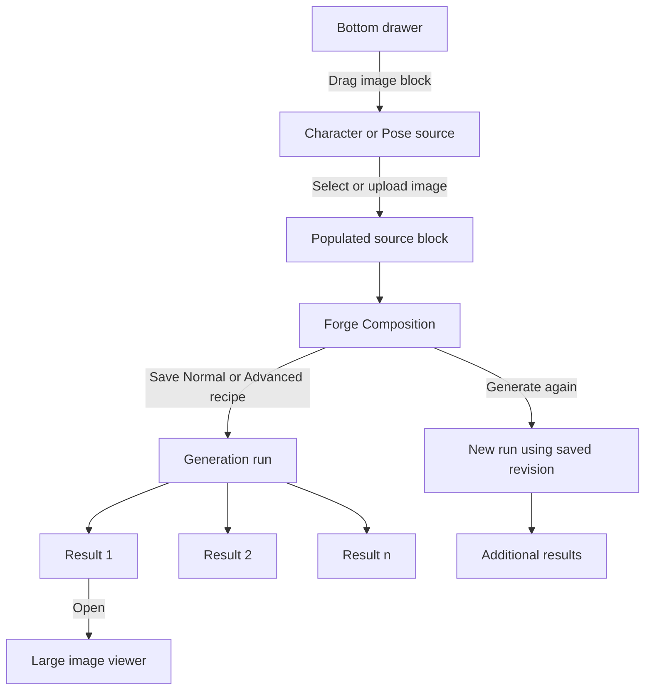
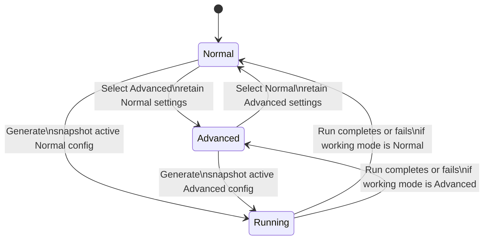

# Product Requirements Document: PoseForge Fluid Studio

**Status:** Draft for product and engineering review  
**Product area:** PoseForge Studio  
**Owner:** Product  
**Last updated:** August 17, 2026  
**Companion documents:** `poseforge-design-spec.md`, PoseForge Canvas Spec, `ARCHITECTURE.md`  
**Target release:** Phased release; dates to be set after technical sizing

---

## 1. Summary

PoseForge Studio will evolve from a mostly transient, rigid node canvas into a fluid, persistent composition workspace. Users will be able to drag image blocks from the bottom drawer, choose or upload images directly in context, resize and organize blocks, save Normal or Advanced generation settings inside each Forge Composition block, generate multiple outputs without losing previous work, rerun a specific composition, and inspect generated images in a large detail viewer.

The central product decision is that a **Forge Composition block is a saved, rerunnable recipe**, not merely a button connected to the current global form. It owns its input references and generation settings. Every generation run creates one or more Result blocks linked back to the exact composition revision that produced them. This gives users a trustworthy visual history of their creative process.

The release should solve six user needs:

1. Make panning, zooming, arranging, selecting, and editing the Studio feel continuous and responsive.
2. Let users request multiple images, generate again, and keep prior results on the canvas.
3. Let users drag image blocks from the bottom drawer, drop them where intended, and select an image without leaving the Studio.
4. Replace rigid boxes with configurable blocks that can be resized, collapsed, expanded, and rearranged.
5. Save Normal or Advanced settings inside each Forge Composition block and restore them faithfully.
6. Let users open a generated image in a large viewer for detailed inspection, comparison, download, and rerun actions.

This PRD does not propose a general-purpose node programming system. The canvas remains optimized for PoseForge's composition workflow: image sources flow into a Forge Composition, which produces inspectable Result blocks.

---

## 2. Contacts

| Role | Responsibility | Named owner |
|---|---|---|
| Product owner | Scope, priority, success metrics, launch decision | TBD |
| Product design | Canvas interactions, node states, drawer, viewer, theme parity | TBD |
| Web engineering | React Flow canvas, inspector, state management, accessibility | TBD |
| Backend engineering | Project persistence, run lineage, generation APIs, migrations | TBD |
| AI/generation owner | Engine capability, variant limits, rerun reproducibility | TBD |
| QA | Cross-browser, interaction, persistence, regression and accessibility testing | TBD |
| Analytics owner | Event schema, dashboards, post-release measurement | TBD |

### Decision ownership

- Product decides MVP scope, output-count limits, default block behavior, and rollout gates.
- Design decides final interaction details within the requirements and accessibility constraints in this document.
- Engineering decides the storage implementation and layout library after validating that saved projects, revision safety, and run lineage are preserved.
- AI/generation ownership decides provider-specific limits but must expose those limits before the user submits a run.

---

## 3. Background

### 3.1 User problem

Pose generation is iterative. A user rarely creates one image, accepts it, and leaves. They try a character against multiple poses, adjust settings, request several variants, compare outputs at a useful size, and rerun a promising setup. The current Studio visually resembles a node canvas but behaves more like one global form projected into fixed boxes. This mismatch creates friction and weakens trust:

- The canvas feels rigid because block placement and dimensions are heavily fixed.
- Drawer interactions do not consistently create a real block at the user's drop point.
- A new generation replaces the visible active batch instead of extending the shoot.
- Regenerate uses the current global state, which may no longer match the settings that created the selected result.
- Normal and Advanced settings belong to the page-level form rather than to an individual composition.
- Generated images cannot be examined in a dedicated high-resolution viewer.
- Canvas history focuses on movement, not meaningful graph and configuration changes.
- The Studio's day and night palettes can diverge because canvas colors are not consistently sourced from semantic theme tokens.

These behaviors are manageable for a one-shot workflow but break down for a creative session with several poses, configurations, and results.

### 3.2 Current implementation

The existing implementation already provides a strong base:

- React Flow supplies panning, zooming, node dragging, handles, edges, controls, and fit-view behavior.
- Character, Pose, Generate, and Result nodes already exist.
- The bottom drawer exposes source cards and suggested poses.
- Result nodes already expose Download, History, and Regenerate actions.
- The generation backend persists `studio_mode`, `advanced_settings`, batch IDs, source inputs, and output records.
- Advanced mode supports multiple variants, while Normal mode currently forces one.
- The generation queue already supports configurable concurrency.

The main limitation is the state boundary. Studio state currently acts as one global form, while the graph and its block positions are largely transient. There is no durable project document, no per-composition configuration record, and no explicit run lineage connecting results to the exact configuration that produced them.

### 3.3 Current state versus target state

| Area | Current state | Target state |
|---|---|---|
| Canvas | Draggable nodes with layout frequently derived from fixed positions | Persisted, direct-manipulation workspace with smooth pan, zoom, drag, resize, selection, and layout |
| Source drawer | Some cards open a source panel; suggested poses can be toggled | Every draggable item creates a real source block at the drop point and immediately supports image selection |
| Block shape | Fixed source/generate width and fixed result width | Type-specific defaults plus safe user resizing, collapsing, and persisted size |
| Generation state | One global Studio form | Configuration saved inside each Forge Composition block |
| Results | Most recent active generation IDs replace earlier visible output | Every run appends Result blocks; earlier results remain until explicitly removed |
| Generate again | Resubmits current global state | Reruns the selected Forge Composition revision, with an optional editable copy |
| Lineage | Batch IDs exist, but canvas relationships are transient | Result → run → composition revision → connected inputs is durable and inspectable |
| Image inspection | Card-size preview and download | Large accessible viewer with zoom, pan, fit, 100%, metadata, navigation, download, and rerun |
| Themes | Some canvas colors are hard-coded and day/night parity can drift | Semantic canvas tokens define complete light and dark palettes with contrast checks |
| Undo/redo | Primarily node movement | Structural and configuration operations are recoverable within the session |

### 3.4 Why now

The Canvas Spec establishes a clear visual and interaction direction, and the existing React Flow foundation removes the need to build an infinite canvas from scratch. The next investment should make the underlying product model match that visual promise. Adding more surface-level actions without per-composition persistence would compound ambiguity: users could create more results but could not reliably know or reproduce how each one was made.

### 3.5 Product principles

1. **The canvas is the session.** A returning user should see the same composition, arrangement, and results.
2. **Every result is traceable.** Users can identify the inputs and settings that produced it.
3. **Creative work accumulates.** A rerun adds to the shoot; it does not silently erase the last run.
4. **Direct manipulation is truthful.** Dropping, moving, resizing, connecting, and selecting immediately change the actual project.
5. **Defaults are simple; depth is local.** Normal mode remains approachable, while Advanced settings live inside the composition that uses them.
6. **Images get priority.** Result blocks and the detail viewer optimize for judging visual output.
7. **Day and night are equal products.** Both themes use one semantic token system and meet the same contrast and state-legibility requirements.

---

## 4. Objective

### 4.1 Objective statement

Enable creators to build, iterate on, and inspect multi-image PoseForge shoots in one persistent canvas without losing results or the settings that produced them.

### 4.2 Proposed SMART key results

Targets are proposals and should be baselined before launch.

| Key result | Target | Measurement window |
|---|---|---|
| Increase successful multi-run sessions | At least 35% of active Studio sessions complete two or more generation runs | Within 60 days of general availability |
| Improve iteration depth | Increase median accepted generation runs per creating session by 25% from the pre-release baseline | Within 60 days |
| Reduce setup friction | At least 80% of users who start a drawer drag successfully create and populate a source block without opening unrelated navigation | Within 30 days |
| Preserve user work | At least 99.5% of acknowledged canvas edits are present after reload, excluding actions made while explicitly offline before sync | First 30 days |
| Make reruns trustworthy | At least 99.9% of reruns submit the stored composition revision shown to the user | First 30 days |
| Improve output inspection | At least 40% of sessions with a completed result open the detail viewer; fewer than 2% abandon it due to an interaction error | Within 60 days |
| Maintain interaction quality | Pan/zoom/drag renders at 50+ FPS at p75 on supported desktop hardware with 30 visible blocks; selection feedback appears within 100 ms at p95 | Before full rollout and continuously thereafter |
| Maintain generation reliability | No more than a 1 percentage-point regression in successful generation completion rate | First 30 days |

### 4.3 Guardrail metrics

- Generation cancellation and failure rate.
- Median and p95 time from Generate click to queued confirmation.
- Project-save error rate and conflict rate.
- Browser memory use at 10, 30, and 100 result blocks.
- Accidental node deletion recovery rate.
- Advanced-mode support tickets related to settings not being retained.
- Light/dark accessibility violations in automated and manual audits.
- Generated-image storage growth per active creator.

### 4.4 Non-goals for the objective

- Becoming a general visual workflow automation tool.
- Providing image editing, masking, retouching, or layer compositing in the detail viewer.
- Guaranteeing pixel-identical model output from the same settings; rerun reproducibility means identical submitted inputs and configuration, not deterministic inference.

---

## 5. Market Segments

### 5.1 Primary segments

#### Iterative creators

Creators who test several poses or generation settings for one character and need to compare results. Their core need is to keep context and results visible while iterating quickly.

#### Batch content producers

Users producing a set of related assets for social posts, catalogs, character packs, or campaigns. They need multiple outputs, predictable reruns, and a visible mapping from one character to several poses.

#### Quality-focused visual professionals

Photographers, designers, and creative directors who judge details such as face identity, hands, texture, framing, and artifacts. They need a neutral canvas and a high-resolution inspection experience.

### 5.2 Secondary segments

#### Casual first-time users

Users who need a simple path: add a character, add a pose, connect them to a Forge Composition, and generate. Normal mode and strong defaults must protect them from canvas complexity.

#### Advanced prompt and model users

Users who tune engines, prompts, aspect ratios, output counts, quality, and provider-specific options. They need each configuration to be stored locally with the composition and clearly distinguished from other setups.

### 5.3 Needs by segment

| Need | Casual | Iterative | Batch | Quality-focused | Advanced |
|---|---:|---:|---:|---:|---:|
| Guided source selection | High | Medium | Medium | Medium | Low |
| Persistent canvas | Medium | High | High | High | High |
| Multiple retained results | Medium | High | High | High | High |
| Configurable block layout | Low | High | High | Medium | High |
| Saved composition settings | Medium | High | High | High | High |
| Large image inspection | Medium | High | Medium | Critical | High |
| Fast rerun | Medium | Critical | Critical | High | Critical |

---

## 6. Value Propositions

### 6.1 User value

- **Iterate without losing work:** each generation adds results while preserving earlier options.
- **Recreate with confidence:** every Result is tied to the Forge Composition revision that produced it.
- **Work visually:** sources can be dragged into place and configured where the user is already focused.
- **Make the workspace fit the job:** blocks can be resized, collapsed, and organized instead of forcing every task into one rigid layout.
- **Judge output properly:** generated photos can be inspected at fit-to-screen or actual-size zoom without leaving the shoot.
- **Switch themes without visual mismatch:** the Studio retains hierarchy, legibility, and accurate image surround in both day and night modes.

### 6.2 Business value

- More generation runs and deeper iteration can increase engagement and paid generation consumption.
- Persistent projects create a reason to return to PoseForge rather than treating each visit as a disposable one-shot tool.
- Saved recipes reduce failed or unintended reruns, lowering support burden and wasted inference cost.
- Clear lineage and result history provide a foundation for future duplication, templates, collaboration, and version comparison.

### 6.3 Competitive differentiation

PoseForge combines the simplicity of a focused character-and-pose generator with the memory and spatial clarity of a creative canvas. The differentiation is not node count; it is that a user can see the ingredients, recipe, and outputs of an entire shoot and rerun any recipe confidently.

---

## 7. Solution

### 7.1 Experience overview

The target workflow is:



The first usable project should feel simple: the canvas can start with one Character block, one Pose block, and one Forge Composition block in a tidy vertical flow. More capable users can add sources, duplicate compositions, adjust sizes, and preserve many result branches.

### 7.2 Core product model

#### Studio Project

A Studio Project is the durable canvas document. It contains:

- Project identity, owner, name, created/updated timestamps, and schema version.
- Canvas viewport state: pan position and zoom level.
- Blocks: type, position, dimensions, collapsed state, selected source references, and type-specific configuration.
- Edges: source and target block/port IDs.
- Forge Composition revisions.
- Generation runs and Result block references.
- A monotonically increasing document revision for conflict-safe saves.

The system must automatically create a project for an existing or newly opened Studio session. A user does not need to understand the term “project” before generating.

#### Forge Composition block

The current Generate node becomes, or is presented as, the **Forge Composition** block. It owns the recipe for a generation:

- Mode: Normal or Advanced.
- Engine/model and model version where available.
- Connected Character source ID.
- Connected Pose source ID or IDs, subject to the supported workflow.
- Prompt/instructions and selected presets.
- Normal settings.
- Advanced settings.
- Output count.
- Aspect ratio, quality, resolution, seed behavior, and provider-specific options.
- A validated configuration status and last-modified timestamp.

Clicking Generate creates an immutable **composition revision snapshot**. Later edits update the working block configuration but do not mutate the snapshot linked to existing results.

#### Run and Result

A Run is one submission of one composition revision. It contains status, requested output count, generation IDs, timestamps, errors, and cost/credit metadata where applicable. Every successful output creates its own Result block.

A Result stores or references:

- Generation ID and run ID.
- Composition block ID and immutable revision ID.
- Optional parent Result ID when “Generate again from this result” is supported.
- Output asset, dimensions, MIME type, and generated metadata.
- Canvas position and display size.

This lineage supports the statement: “This image came from this exact recipe and these exact sources.”

### 7.3 Recommended persistence model

Engineering may use normalized tables or a versioned project document plus normalized runs, provided the required behavior is maintained. A recommended shape is:

| Entity | Required fields | Notes |
|---|---|---|
| `studio_projects` | `id`, `user_id`, `name`, `schema_version`, `revision`, viewport, timestamps | Revision enables optimistic concurrency |
| `studio_nodes` | `id`, `project_id`, `type`, position, dimensions, collapsed state, `data_json`, timestamps | `data_json` is type-validated by schema |
| `studio_edges` | `id`, `project_id`, source/target node and port IDs, timestamps | Enforce allowed connection types |
| `composition_revisions` | `id`, `project_id`, `node_id`, revision number, mode, full settings JSON, input snapshot JSON, timestamps | Immutable after a run references it |
| `studio_runs` | `id`, `project_id`, `composition_revision_id`, status, output count, error summary, timestamps | One row per Generate/Generate again action |
| `generations` | Existing generation data plus `studio_run_id`, `composition_node_id`, optional `parent_generation_id` | Backward-compatible extension |

If a project document is stored as JSON, runs and generation lineage should remain queryable outside the blob for reliability, support, and analytics.

### 7.4 Functional requirements

#### A. Fluid canvas

| ID | Requirement | Priority |
|---|---|---|
| FLD-01 | Pan, zoom, block drag, resize, selection, connection, and drawer-drop interactions must update continuously without a full canvas rebuild. | Must |
| FLD-02 | User-set positions must be preserved. Adding or completing a Result must not move unrelated blocks. | Must |
| FLD-03 | The project must autosave meaningful changes and restore the same block positions, sizes, edges, collapsed states, and viewport on reload. | Must |
| FLD-04 | Autosave should be debounced during continuous movement and expose Saving, Saved, Offline/Retrying, and Save failed states. | Must |
| FLD-05 | Fit View must frame all relevant blocks without hiding them behind the bottom drawer or inspector. | Must |
| FLD-06 | Tidy must arrange selected blocks when a selection exists, otherwise all blocks. It must be undoable and use vertical flow with type-appropriate spacing. | Should |
| FLD-07 | Lock must prevent accidental block moves, resizing, edge edits, and drawer drops while retaining selection, inspection, zoom, and pan. | Must |
| FLD-08 | Undo/redo must cover block add/remove/move/resize, edge add/remove, collapse/expand, and composition-setting changes made during the current session. Generation submissions themselves are not undone. | Should |
| FLD-09 | Keyboard users must be able to select blocks, move focus among blocks and actions, delete with confirmation/recovery, and open the inspector. | Must |
| FLD-10 | The canvas must use semantic theme tokens for pane, dots, blocks, borders, text, ports, edges, focus, hover, selection, controls, and drawer in both day and night modes. | Must |
| FLD-11 | Fit View runs on initial project open only, or after an explicit Fit/Tidy action. Selection, source changes, run creation, and result status updates must not move the camera. | Must |

**Interaction guidance**

- Hover lift may be used, but movement must not obscure handles or create layout reflow.
- Selected state uses the brand border plus a visible focus treatment for keyboard navigation.
- Animated transitions must respect `prefers-reduced-motion`.
- The canvas remains a neutral image-judging surface. Recommended night canvas tokens start from pane `#141018`, dots `#3A3442`, and blocks `#1C1721`; final day and night colors must be validated together rather than maintained as separate ad hoc rules.

**Acceptance criteria**

1. Given a user moves and resizes three blocks, when the page is reloaded after Saved appears, then every block and the viewport return to the saved state.
2. Given a run completes, when Result blocks are appended, then no user-positioned source or composition block moves.
3. Given the canvas is locked, when the user drags a block or resize handle, then geometry does not change; zoom, pan, selection, and image viewing continue to work.
4. Given day or night mode is changed, then every canvas surface and interaction state changes through semantic tokens without unreadable text, invisible handles, or stale light-only colors.

#### B. Multiple outputs and Generate again

| ID | Requirement | Priority |
|---|---|---|
| GEN-01 | A Forge Composition must expose an output-count selector using only values supported by the selected engine and account tier. Proposed MVP defaults are 1–4 in Normal and 1–6 in Advanced, capped lower when required. | Must |
| GEN-02 | Submitting a run must immediately create a visible pending run state without blocking canvas use. | Must |
| GEN-03 | Each requested output must resolve to a distinct Result block or a clearly represented failed slot. | Must |
| GEN-04 | New runs append results; they never replace earlier Result blocks automatically. | Must |
| GEN-05 | Generate again from a Forge Composition must submit the composition's saved working settings as a new immutable revision. | Must |
| GEN-06 | Generate again from an existing Result must default to the immutable revision that produced that Result, even if the working composition has since changed. | Must |
| GEN-07 | Before rerunning an older revision, the UI must identify that it is an earlier version and offer “Run exact settings” or “Load as editable copy.” | Should |
| GEN-08 | Users must be able to cancel queued or running outputs when the provider supports cancellation. Completed siblings remain. | Should |
| GEN-09 | Partial success must preserve successful outputs and show retryable failure information only for failed outputs. | Must |
| GEN-10 | The UI must disclose output count and credit/cost impact before submission when credit information is available. | Must |
| GEN-11 | Users can remove a Result block from the canvas without immediately deleting the underlying generation asset. Permanent deletion remains a separate confirmed action. | Must |
| GEN-12 | The canvas must remain usable as results arrive asynchronously and should batch layout suggestions rather than repeatedly shifting the view. | Must |
| GEN-13 | “Use as input” on a Result creates a new source Image block backed by that generated asset; it does not mutate or reclassify the original Result. | Should |
| GEN-14 | Results display a compact run grouping label containing run order, mode, and creation time so users can distinguish batches. | Should |

**Result placement**

- The first run is placed below its Forge Composition in a tidy row or column that respects current zoom and viewport obstruction.
- Further runs occupy the next open result region.
- If automatic placement would overlap user-positioned content, place results in the nearest open region and show a brief “Results added” locator action.
- Completing an output must not steal selection or force-fit the viewport.

**Acceptance criteria**

1. Given a composition requests four outputs, when the run completes with three successes and one failure, then three Result blocks remain and one failed slot explains the error and permits retry.
2. Given prior results exist, when the user chooses Generate again, then new Result blocks appear and all prior results remain unchanged.
3. Given the composition was edited after Result A was created, when Generate again is initiated from Result A and “Run exact settings” is chosen, then the request matches Result A's stored revision rather than the current inspector state.
4. Given the user removes a Result block, then the layout updates and Undo can restore the block without re-running generation.
5. Given the user chooses Use as input, then a new source block is created with lineage to the Result asset and can be connected to a later composition while the original Result remains unchanged.

#### C. Drag-and-add image blocks

| ID | Requirement | Priority |
|---|---|---|
| DRG-01 | The bottom drawer must offer draggable Character Image and Pose Image block types. | Must |
| DRG-02 | Dragging must show a type-specific ghost and valid/invalid drop feedback. | Must |
| DRG-03 | Dropping on an unlocked canvas creates a real block with its origin at the converted canvas drop position, adjusted only to remain reachable. | Must |
| DRG-04 | A newly dropped empty block is selected and immediately opens an anchored image picker or its inspector selection state. | Must |
| DRG-05 | The picker supports upload, existing library assets, generated/history assets, and type-appropriate suggestions where available. | Must |
| DRG-06 | Selecting an image populates the block without changing its position and autosaves the source reference. | Must |
| DRG-07 | Canceling the picker leaves an explicit empty block that can be populated later; Escape must not silently destroy it. | Must |
| DRG-08 | Clicking, rather than dragging, a drawer type creates it at the center of the unobscured viewport and opens the same picker. | Should |
| DRG-09 | Duplicate source assets are allowed because one image may participate in separate visual groupings. | Must |
| DRG-10 | Unsupported files show inline validation for type, size, and dimensions before upload begins where detectable. | Must |

**Acceptance criteria**

1. Given the canvas is zoomed and panned, when a Character Image block is dropped, then it appears under the pointer in canvas coordinates rather than screen coordinates.
2. Given a blank block is dropped, when an existing image is selected, then its preview, metadata, and output handle appear without navigating away or opening a full-page modal.
3. Given the canvas is locked, drawer cards are visibly disabled and cannot be dropped.
4. Given a file is rejected, the empty block remains selected and clearly explains how to correct the issue.

#### D. Configurable blocks

| ID | Requirement | Priority |
|---|---|---|
| CFG-01 | Character, Pose, Forge Composition, and Result blocks must have type-specific default, minimum, and maximum dimensions. | Must |
| CFG-02 | Selected unlocked blocks expose resize handles. Resizing must not break handles, actions, text, or image aspect behavior. | Must |
| CFG-03 | Source and Result image frames support Fit and Fill display modes without altering the underlying asset. | Should |
| CFG-04 | Blocks can be collapsed to a compact header and expanded to their last saved size. | Must |
| CFG-05 | Position, dimensions, collapsed state, and display mode persist per block. | Must |
| CFG-06 | Block content must reflow at defined breakpoints; it must not merely scale text and controls. | Must |
| CFG-07 | A Reset size action restores the type default. | Should |
| CFG-08 | Multi-select resize is out of scope for MVP; multi-select move and tidy may be retained if technically safe. | Could |
| CFG-09 | Ports remain attached to predictable edges and are reachable at every supported dimension. | Must |
| CFG-10 | Resizing a Result block preserves the image's intrinsic aspect ratio by default; holding the platform modifier may allow a freeform frame if approved by design. | Should |
| CFG-11 | Every block exposes an action menu for Rename, Duplicate, Reset size, Collapse/Expand, Disconnect where applicable, and Remove from canvas. | Must |

**Proposed size constraints**

| Block type | Default | Minimum | Maximum/behavior |
|---|---:|---:|---|
| Character | 330 × content height | 260 × 180 | 520px width; image frame reflows |
| Pose | 330 × content height | 260 × 180 | 520px width; image frame reflows |
| Forge Composition | 330 × content height | 300 × 180 | 560px width; inspector remains primary for dense settings |
| Result | 480px wide, intrinsic aspect | 280px wide | 960px wide on canvas; viewer handles larger inspection |

Final values require design validation at supported breakpoints. User resizing must not modify generation output dimensions or aspect ratio; those are composition settings.

**Acceptance criteria**

1. Given a block is resized, when its minimum or maximum is reached, then resizing stops cleanly and the content remains usable.
2. Given a Result is resized, then the source image is not re-encoded or cropped unless the user changes the frame display from Fit to Fill.
3. Given a block is collapsed, when the project reloads, then it remains collapsed and can be expanded to its previous dimensions.
4. Given a source block is made narrower, its image, labels, actions, and ports reflow without clipping or overlap.

#### E. Forge Composition saves Normal and Advanced settings

| ID | Requirement | Priority |
|---|---|---|
| CMP-01 | Each Forge Composition block owns its mode and full type-validated configuration. | Must |
| CMP-02 | Selecting a composition populates the right inspector from that block, not from an unrelated global form. | Must |
| CMP-03 | Switching between two compositions restores each one's independent mode and settings. | Must |
| CMP-04 | Switching Normal ↔ Advanced follows an explicit preservation policy and never silently discards advanced values. | Must |
| CMP-05 | Recommended policy: retain both `normalSettings` and `advancedSettings`; `activeMode` chooses which set is submitted. | Must |
| CMP-06 | Generate is disabled until required connections and configuration are valid; missing items are identified on both the block and inspector. | Must |
| CMP-07 | Every run stores an immutable snapshot of active mode, all submitted settings, resolved input asset references, engine/model identifiers, and schema version. | Must |
| CMP-08 | Existing pre-project generations must remain viewable. When added to a project, they are represented as legacy Results with available metadata and an explicit “settings incomplete” state if needed. | Must |
| CMP-09 | Duplicating a composition copies its working settings but creates a new block identity and independent future revisions. | Should |
| CMP-10 | An older Result can load its snapshot into a new or duplicated editable composition without changing the original composition automatically. | Should |
| CMP-11 | If a composition is edited while one of its runs is active, the UI states “Changes apply to next run”; the active run remains tied to its submitted snapshot. | Must |

**Configuration shape**

```ts
type ForgeCompositionConfig = {
  schemaVersion: number;
  activeMode: "normal" | "advanced";
  engineId: string;
  modelId?: string;
  prompt: string;
  presets: string[];
  normalSettings: {
    aspectRatio: string;
    quality: string;
    outputCount: number;
  };
  advancedSettings: {
    aspectRatio: string;
    quality: string;
    outputCount: number;
    seed?: number;
    guidance?: number;
    steps?: number;
    providerOptions: Record<string, unknown>;
  };
  inputNodeIds: {
    characterId: string | null;
    poseIds: string[];
  };
};
```

This is a product-level contract, not a required literal TypeScript implementation. Settings unsupported by the chosen engine should be absent or marked unavailable rather than submitted and ignored.

**Mode-switch behavior**



**Acceptance criteria**

1. Given Composition A is Advanced and Composition B is Normal, when the user alternates selection, then each inspector restores the correct mode and values.
2. Given Advanced values were set, when the user switches to Normal and back, then the Advanced values remain unchanged unless an engine change makes a field invalid; any adjustment is disclosed.
3. Given a run has been submitted, when the working composition is edited, then existing Result metadata and rerun behavior continue to reference the immutable submitted revision.
4. Given a required source is missing, Generate is disabled and the missing connection is identified without requiring a failed API request.

#### F. Large generated-image viewer

| ID | Requirement | Priority |
|---|---|---|
| VWR-01 | Double-clicking the result image, pressing Enter on its Open action, or choosing View large opens an accessible modal/lightbox above the Studio. | Must |
| VWR-02 | The viewer uses the highest appropriate available resolution and displays a loading state without blocking close. | Must |
| VWR-03 | Controls include zoom in/out, Fit, 100%, pan when zoomed, close, download, Generate again, and Use as input. | Must |
| VWR-04 | The viewer shows dimensions, aspect ratio, engine/model where available, creation time, run position, and composition mode. Detailed settings may open a metadata panel. | Must |
| VWR-05 | Left/right controls and arrow keys navigate among results in the current run; an optional All project scope can follow later. | Must |
| VWR-06 | Escape closes; focus is trapped while open and returns to the invoking Result block. | Must |
| VWR-07 | At 100%, one source image pixel maps to one CSS pixel subject to browser/device constraints; the user can pan to inspect off-screen areas. | Must |
| VWR-08 | Zoom centers on pointer position for wheel/pinch and on viewport center for buttons/keyboard. | Should |
| VWR-09 | Viewer actions must not modify block dimensions or canvas viewport. | Must |
| VWR-10 | Errors loading the full-resolution asset fall back to the preview and expose Retry; users can still close or navigate. | Must |
| VWR-11 | The image surround must use a neutral dark viewing surface in both product themes to reduce perceptual color distortion, while controls follow the active day/night theme tokens. | Must |

**Viewer keyboard map**

| Key | Action |
|---|---|
| `Escape` | Close |
| Left/Right Arrow | Previous/next result in run when focus is not in an editable control |
| `+` / `-` | Zoom in/out |
| `0` | Fit to screen |
| `1` | 100% |
| Space + drag | Pan while zoomed, if it does not conflict with assistive technology behavior |

**Acceptance criteria**

1. Given a Result is focused, when Enter activates View large, then the dialog opens, announces its title, traps focus, and supports close with Escape.
2. Given the image is larger than the viewport, when 100% is selected, then the user can pan to every image edge without scaling the underlying asset.
3. Given a run contains multiple successful results, arrow navigation updates the image and metadata without closing the viewer.
4. Given Generate again is selected, the user sees whether the exact historical recipe or current edited composition will run before submission.

### 7.5 Inspector behavior

The right inspector remains the primary editor for dense configuration.

- Selecting a Character or Pose block shows source selection, replace, crop/display preferences, metadata, and remove actions.
- Selecting a Forge Composition shows mode, engine, Normal or Advanced settings, connected inputs, validation, output count, estimated cost/credits, Generate, and Generate again.
- Selecting a Result shows preview metadata, lineage, View large, Download, Generate again, locate source composition, hide from canvas, and permanent delete.
- Selecting empty canvas shows project-level settings, including name and theme behavior where appropriate.
- Selection must never copy settings from one block into another unless the user explicitly chooses Duplicate or Load as editable copy.

On narrow screens where a 368px inspector and canvas cannot coexist, the inspector may become an overlay sheet. Canvas coordinates and viewport must remain stable when it opens or closes.

### 7.6 Connection and validation rules

MVP connection rules:

- Character output → Forge Composition Character input.
- Pose output → Forge Composition Pose input.
- Forge Composition output → Result input is system-created and represents lineage; users do not manually connect completed Results in MVP.
- A composition requires exactly one Character and at least one Pose to generate under the current model contract.
- If the backend only supports one Pose per generation, connecting multiple Pose blocks should either create an explicit batch run or be disallowed with clear feedback. Product must decide before implementation.
- Invalid connections are rejected during hover/drop, not accepted and repaired later.
- Replacing a connected source updates the working configuration only. Existing composition revisions retain the resolved source snapshot used for their runs.

### 7.7 Autosave, offline, and conflict handling

- Local UI state updates immediately; server persistence is debounced for continuous gestures.
- Generate must flush pending composition and graph saves before creating the immutable revision, or submit the working configuration atomically with the run.
- Each save includes the last acknowledged project revision.
- If the server reports a revision conflict, automatic merge is allowed only for non-overlapping fields. Otherwise the user sees a recoverable conflict state and both versions remain available.
- Temporary network failure must not reset the canvas. The header or canvas status communicates Retrying.
- Closing with unsaved unrecoverable changes should prompt the user where browser capabilities allow.
- MVP is not a full offline editor. Generation requires a connection.

### 7.8 Performance and scalability requirements

| Area | Requirement |
|---|---|
| Interaction | Selection feedback ≤100 ms p95; pointer-driven geometry should remain visually continuous |
| Canvas | 50+ FPS p75 while panning/zooming a representative 30-block project on supported desktop hardware |
| Large projects | Remain functional at 100 blocks; image previews may be virtualized or progressively loaded |
| Assets | Use thumbnails on canvas; fetch high-resolution assets only for viewer/download as needed |
| Autosave | Acknowledgement target ≤2 seconds p95 after the final edit under normal connectivity |
| Run submission | Queued acknowledgement target ≤1 second p95, excluding provider execution |
| Memory | Release viewer assets and object URLs after close; avoid retaining full-resolution images for every Result block |
| Layout | Tidy 100 blocks within 1 second on supported hardware or show non-blocking progress |

### 7.9 Accessibility requirements

- Meet WCAG 2.2 AA for Studio controls, dialogs, text, and actionable states.
- Do not use color alone to communicate selection, validity, failure, mode, or run status.
- All pointer interactions require keyboard-operable equivalents.
- Drag-and-drop source creation has the click-to-add alternative.
- Resize has keyboard-accessible controls in the block action menu or inspector.
- Focus order must remain predictable despite spatial placement.
- Announce generation queued, progress/status changes, completion count, and failures through a polite live region without excessive repetition.
- Honor reduced motion and increased contrast preferences where supported.
- Day and night themes must each pass contrast validation; switching themes must not close dialogs, reset selection, or change canvas geometry.

### 7.10 Error and empty states

| Situation | Required response |
|---|---|
| Empty project | Show a short canvas prompt plus highlighted drawer options; do not cover the drop area |
| Empty source block | Show Select image and Drop image here actions with accepted-format guidance |
| Missing connection | Mark the relevant composition port/field and provide a plain-language repair action |
| Unsupported setting | Disable it with reason or migrate it visibly; never submit and silently ignore |
| Generation failure | Keep the run and successful siblings; show retry, details, and support reference |
| Save failure | Preserve local state, show retrying/save-failed status, and prevent false “Saved” feedback |
| Full-resolution load failure | Retain preview, offer Retry and Download if available |
| Deleted source used by history | Preserve the immutable input snapshot or thumbnail required to understand existing results |

### 7.11 Analytics and instrumentation

Every event includes anonymous/user ID as permitted, project ID, session ID, app version, theme, project block count, and timestamp. Generation events additionally include composition ID, revision ID, run ID, mode, engine, requested output count, and source-entry method. Do not include raw prompts or private asset URLs in general analytics.

| Event | Trigger | Key properties |
|---|---|---|
| `studio_project_opened` | Project hydration succeeds | new/existing, block/result counts, load duration |
| `studio_node_added` | Node is committed | type, drawer click/drag/duplicate, drop success |
| `studio_source_selected` | Source is assigned | type, upload/library/suggestion, time from node add |
| `studio_node_resized` | Resize gesture ends | type, old/new dimensions, reset used |
| `studio_node_collapsed` | Collapse state changes | type, collapsed |
| `studio_connection_changed` | Edge add/remove | source/target types, valid/rejected reason |
| `composition_mode_changed` | Normal/Advanced changes | from/to, invalidated field count |
| `composition_generate_clicked` | User confirms run | mode, output count, validation state, estimated cost shown |
| `generation_run_queued` | Backend accepts run | run ID, revision ID, output count |
| `generation_run_completed` | Run reaches terminal state | success/failure counts, total duration |
| `generate_again_started` | Rerun path begins | source composition/result, exact/editable choice, revision age |
| `result_viewer_opened` | Viewer opens | invocation, result index, preview/full availability |
| `result_viewer_zoomed` | Meaningful zoom change | fit/100/custom, input method |
| `result_downloaded` | Download begins | from card/viewer |
| `studio_save_failed` | Save exhausts normal retries | mutation type, conflict/network/server |
| `studio_theme_changed` | Theme changes in Studio | from/to/system, viewer open |

Analytics must support funnels for:

1. Drawer interaction → block created → source selected → valid composition → first run.
2. First run → result opened → Generate again → second successful run.
3. Advanced mode selected → settings saved → run completed → rerun exact settings.

### 7.12 API requirements

The exact endpoints may follow current conventions. Required capabilities are:

- Create, fetch, rename, update, and archive a Studio Project.
- Apply project graph mutations with optimistic revision checking.
- Create an immutable composition revision and generation run atomically.
- Fetch run status and outputs; existing polling may remain for MVP, with server-sent events or sockets considered later.
- Rerun an exact stored revision.
- Load a revision as an editable working configuration.
- Hide/unhide a Result block independently from permanent generation deletion.
- Fetch viewer-appropriate asset URLs with authorization and expiry handling.
- Preserve existing generation list/get/download behavior for backward compatibility.

The run creation response should return the run ID, composition revision ID, expected output slots, and authoritative submitted configuration summary immediately.

### 7.13 Migration and backward compatibility

1. Add nullable project/run/lineage fields to existing generation storage before requiring them.
2. Existing generation history remains accessible through the current History experience.
3. On first use of the new Studio, create a default project. Do not attempt to infer an entire historical graph from unrelated old generations.
4. When a legacy generation is placed on the canvas, create a Result block marked as legacy and populate all known metadata. Do not claim exact rerun fidelity when required historical settings are absent.
5. Continue accepting current generation API requests during the migration window.
6. Version project documents and composition configuration schemas. Migrations must be deterministic, tested, and non-destructive.
7. A rollback of the new canvas UI must not make newly generated assets inaccessible through History.

### 7.14 Security and privacy

- Enforce project and asset ownership on every project, revision, run, image, and viewer request.
- Use signed or authenticated asset access; do not expose local filesystem paths.
- Validate file type by content as well as extension and enforce configured size/dimension limits.
- Sanitize project names and freeform metadata rendered in nodes or dialogs.
- Do not put prompts, source image URLs, or provider secrets into client logs or broad analytics.
- Permanent asset deletion requires confirmation and must account for references from historical revisions according to the retention policy.
- Rate limits and output-count controls must be enforced server-side, not only in the inspector.

### 7.15 User stories

#### Simple first shoot

As a first-time user, I want to add one character and one pose, so I can generate an image without learning a complex graph tool.

1. User drags Character Image from the drawer.
2. Inline picker opens; user uploads a photo.
3. User drags Pose Image and selects a suggestion.
4. User connects both or accepts suggested auto-connections to the Forge Composition.
5. Composition validates in Normal mode.
6. User selects output count and generates.
7. Result blocks appear and remain on the canvas.

#### Iterative rerun

As an iterative creator, I want to rerun a promising recipe without losing earlier outputs, so I can compare alternatives.

1. User opens a Result in the large viewer.
2. User inspects face and hands at 100%.
3. User chooses Generate again.
4. Viewer identifies the historical composition revision and cost/output count.
5. User chooses Run exact settings.
6. New outputs append to the project and the viewer can navigate them when ready.

#### Two independent compositions

As an advanced user, I want separate Normal and Advanced compositions in one shoot, so I can compare strategies without settings leaking between them.

1. User duplicates a Forge Composition.
2. Composition A stays in Normal mode; Composition B switches to Advanced.
3. Each saves independent engine, output count, prompt, and advanced values.
4. Selecting each block restores its configuration in the inspector.
5. Runs link to their respective revisions and results remain visually grouped.

#### Reorganize a large shoot

As a batch creator, I want to resize and collapse blocks, so I can keep many poses and results understandable.

1. User collapses completed source blocks.
2. User enlarges preferred Results and keeps alternatives smaller.
3. User selects a branch and chooses Tidy selection.
4. Autosave persists geometry and the layout returns on reload.

### 7.16 Out of scope for the first release

- Real-time multi-user collaboration, cursors, comments, and permissions.
- General arbitrary node types, scripting, loops, or conditional execution.
- Manual user-drawn Result edges; the specified Use as input action creates a separate source block instead.
- Image retouching, inpainting, masks, crop export, color correction, and side-by-side pixel diff.
- Mobile-first node editing. Mobile may support history and image viewing; authoring support requires separate validation.
- Cross-project reusable Forge Composition templates.
- Infinite permanent retention independent of the product's storage policy.
- Deterministic reproduction of stochastic model outputs.
- Multi-select resize.
- Full offline generation or conflict-free collaborative data types.

### 7.17 Dependencies

- React Flow version and resize/node APIs used by the current web app.
- A layout engine such as Dagre or ELK for Tidy.
- Durable project and revision storage plus database migrations.
- Existing generation queue, polling, storage, and download authorization.
- Provider capability metadata for output counts and advanced settings.
- Thumbnail generation and high-resolution asset delivery.
- Semantic design tokens covering both day and night Studio palettes.
- Analytics pipeline and dashboards.
- Accessibility testing across supported browsers and assistive technologies.

### 7.18 Risks and mitigations

| Risk | Impact | Mitigation |
|---|---|---|
| Canvas becomes intimidating for simple users | Lower first-generation conversion | Start with a valid guided layout, support click-to-add, auto-connect obvious sources, keep Normal mode concise |
| Per-block state conflicts with existing global reducer | Settings leak or regress | Introduce typed node configuration and migrate inspector reads/writes composition by composition; add isolation tests |
| Autosave overwrites newer edits | Lost work | Optimistic revisions, atomic run snapshots, visible save state, conflict preservation |
| Multiple outputs increase cost unexpectedly | Trust and billing complaints | Show count and estimate before submission; enforce limits server-side |
| Result-heavy canvases become slow | Poor interaction and crashes | Thumbnail canvas assets, lazy full resolution, progressive rendering, performance budgets |
| Exact rerun promise is misleading | User distrust | Define it as exact submitted recipe and inputs, disclose model stochasticity and unavailable legacy metadata |
| Resizing increases layout complexity | Clipped content and inaccessible ports | Type-specific constraints, content breakpoints, automated visual tests, Reset size |
| Day/night palette drift returns | Inconsistent Studio and poor contrast | Semantic tokens only, theme snapshot coverage, contrast audit in release gate |
| Source deletion breaks historical lineage | Results become unauditable | Preserve immutable source snapshots/thumbnails under retention policy |
| Concurrent tabs edit one project | Silent last-write-wins loss | Revision checks; conflict UI; consider cross-tab notification |

### 7.19 Open product decisions

These decisions need product/founder validation before engineering commits to final behavior:

1. **Output count:** Should Normal mode remain one output, or offer a simple 1–4 selector while Advanced supports up to the provider/account maximum?
2. **Multiple poses:** Does one Forge Composition accept multiple Pose inputs as a batch, or exactly one Pose with users duplicating the composition for additional poses?
3. **Default project lifecycle:** Is Studio always one auto-saved workspace, or can users name and manage multiple projects in the first release?
4. **Result removal:** How long are hidden results/assets retained, and when does permanent deletion reclaim storage?
5. **Rerun entry point:** Should Generate again default to exact historical settings or current working settings? This PRD recommends exact historical settings when launched from a Result.
6. **Canvas theme:** Should light product chrome retain a dark image-judging pane, or should day mode use a light pane? This PRD requires token parity and recommends a neutral dark surround for image inspection regardless of chrome theme.
7. **Auto-connect:** When a newly added source has only one valid nearby composition, should PoseForge connect it automatically or only suggest the connection?
8. **Credits:** What cost estimate and confirmation thresholds apply to multi-output and rerun actions?
9. **Project capacity:** What product limits apply to blocks, retained results, and storage by account tier?

---

## 8. Release

### 8.1 Recommended phased delivery

#### Phase 0 — Foundations and measurement

- Baseline current first-generation conversion, repeat-run behavior, latency, and failure rates.
- Introduce semantic day/night Studio tokens and remove hard-coded canvas state colors.
- Define versioned project, node, composition, run, and lineage schemas.
- Add database fields/tables behind a feature flag without changing the public experience.
- Add provider capability metadata and project save observability.

**Exit criteria:** schema and API review complete; existing generation tests pass; baseline dashboard available; theme token inventory complete.

#### Phase 1 — Persistent fluid canvas

- Persist project viewport, blocks, edges, positions, dimensions, and collapse state.
- Stop rebuilding user geometry from fixed positions.
- Add constrained resize, Reset size, collapse/expand, lock semantics, save status, and improved undo/redo.
- Add Tidy for all or selected blocks.
- Validate day/night theme parity and interaction performance.

**Exit criteria:** save/restore reliability reaches 99.5% in internal testing; 30-block performance budget passes; no critical keyboard or contrast violations.

#### Phase 2 — Drawer creation and per-composition settings

- Drag or click Character/Pose blocks into the canvas at the intended location.
- Add inline/inspector image selection.
- Move mode and configuration ownership into each Forge Composition.
- Add immutable composition revisions and validation.
- Migrate current single-composition sessions safely.

**Exit criteria:** two compositions retain isolated settings across selection and reload; source creation funnel is instrumented; required connection errors are fully client-visible.

#### Phase 3 — Multi-output, retained results, and rerun lineage

- Add output-count capability, run entity, pending slots, partial failure behavior, and stable result placement.
- Preserve all prior Result blocks.
- Add Generate again from composition and Result with exact-revision semantics.
- Add legacy-result treatment and history compatibility.

**Exit criteria:** exact-revision contract passes integration tests; partial success and retry pass; no generation reliability regression above the guardrail.

#### Phase 4 — Large image viewer

- Ship the accessible viewer with full-resolution loading, zoom, pan, Fit, 100%, metadata, run navigation, download, and Generate again.
- Add image-loading performance and memory safeguards.
- Complete cross-browser, reduced-motion, keyboard, and screen-reader testing.

**Exit criteria:** viewer accessibility checklist passes; full-resolution failure fallback works; memory returns near baseline after repeated open/close testing.

#### Phase 5 — Controlled rollout and optimization

- Internal dogfood, then opt-in beta, then percentage rollout.
- Compare key results and guardrails by cohort.
- Tune defaults, placement, drawer guidance, and output-count presentation.
- Publish user education and support guidance before general availability.

### 8.2 Rollout strategy

- Gate the new project model and UI with a server-controlled feature flag.
- Start with internal accounts and synthetic projects covering empty, large, legacy, Advanced, partial-failure, and save-conflict states.
- Expand to a small opt-in beta after persistence and lineage telemetry is stable.
- Increase exposure only when save errors, generation success, latency, memory, and support volume remain within guardrails.
- Keep existing History as a fallback route throughout rollout.
- Roll back the UI flag independently from schema additions. Never roll back by deleting new project or lineage data.

### 8.3 Testing strategy

#### Unit and schema tests

- Node configuration validation and schema migration.
- Normal/Advanced preservation and engine capability changes.
- Graph connection validation.
- Run snapshot immutability.
- Result lineage and legacy metadata behavior.
- Theme token completeness.

#### Integration tests

- Autosave, reload, concurrent revision conflict, and retry.
- Generate after unsaved edits produces the visible configuration atomically.
- Multi-output full success, partial success, failure, cancellation, and retry.
- Exact historical rerun after the working composition changes.
- Source replacement does not mutate historical revisions.
- Hide/unhide versus permanent asset deletion.

#### End-to-end tests

- Drag from drawer at non-default zoom and select/upload an image.
- Create two compositions with independent Normal and Advanced settings.
- Resize, collapse, move, tidy, reload, and verify geometry.
- Generate multiple outputs, rerun, and verify prior Results remain.
- Open viewer, zoom, pan, navigate, download, rerun, close, and verify focus return.
- Switch day/night themes with selections, pending runs, and viewer open.
- Keyboard-only and reduced-motion journeys.

#### Performance and resilience tests

- 10, 30, and 100-block projects.
- Many concurrent result completions without viewport jumps.
- Slow, intermittent, and offline network during autosave and polling.
- Repeated high-resolution viewer open/close for memory leaks.
- Stale signed asset URLs and retry.

### 8.4 Launch checklist

- Product decisions in section 7.19 resolved or explicitly deferred.
- Data retention and credit/cost language approved.
- Migrations rehearsed against a production-like copy and rollback path verified.
- Project save, run lineage, and asset authorization dashboards live.
- Theme parity, accessibility, and performance gates pass.
- Support can identify project, composition revision, run, and generation IDs from a user report.
- Help content explains Normal versus Advanced, Generate again semantics, result retention, and viewer controls.
- Feature flag, kill switch, and History fallback tested.

### 8.5 Definition of done

The initiative is complete when a user can open Studio, add and populate image blocks directly from the drawer, arrange and configure the blocks, save independent Normal or Advanced Forge Compositions, generate multiple retained results, rerun an exact prior composition without losing existing outputs, inspect each result at useful scale in an accessible large viewer, and return later to the same saved canvas in either day or night mode—with lineage, reliability, performance, and analytics meeting the release gates above.
