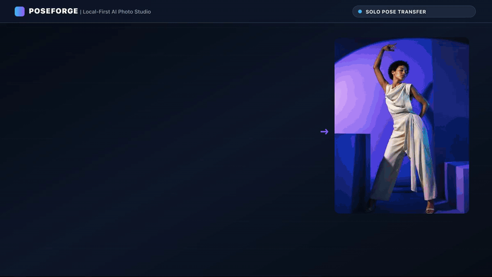
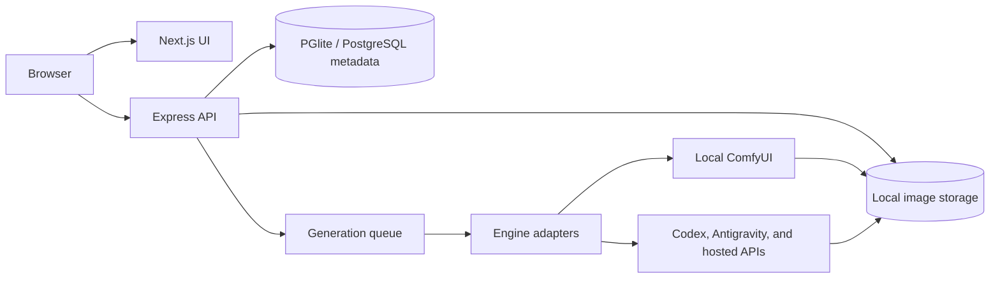

# PoseForge

[](https://github.com/vishwakulkarni/PoseForge/actions/workflows/ci.yml)
[](https://github.com/vishwakulkarni/PoseForge/actions/workflows/web.yml)
[](https://github.com/vishwakulkarni/PoseForge/releases)
[](package.json)
[](docs/COMPATIBILITY.md)
[](docs/COMPATIBILITY.md)
[](LICENSE)

[Open the landing page and documentation](https://vishwakulkarni.github.io/PoseForge/) · The full Studio runs locally because generation, storage, and its embedded database are intentionally not hosted on GitHub Pages.

## Turn the AI subscription you already pay for into a private, local-first photo studio

Give PoseForge an identity photo and a pose reference. It returns the same
person—or family—in the new pose and composition, with controls for camera,
lighting, styling, fidelity, and output format.

PoseForge exists so Codex, Google Antigravity, and ComfyUI users can turn their
existing AI access into a repeatable visual workflow instead of rebuilding the
same multi-image prompt in chat for every photograph.

[](demo-output/poseforge-generation-walkthrough-15s.mp4)

[Watch the 15-second generation walkthrough](demo-output/poseforge-generation-walkthrough-15s.mp4) ·
[Download the lightweight 10-second MP4](web/public/demo/poseforge-readme-demo.mp4) ·
[Quickstart](#quickstart) ·
[How it works](#how-it-works) ·
[Examples](#examples) ·
[Landing page source](web/app/page.tsx) ·
[Documentation](docs/USER_GUIDE.md) ·
[Roadmap](ROADMAP.md) ·
[Support](SUPPORT.md) ·
[Discussions](https://github.com/vishwakulkarni/PoseForge/discussions)

<video controls preload="metadata" width="100%" poster="web/public/demo/poseforge-readme-demo.gif">
  <source src="demo-output/poseforge-generation-walkthrough-15s.mp4" type="video/mp4">
  Your Markdown viewer does not support embedded video. Use the walkthrough link above.
</video>

> **Local-first, not automatically offline.** Your workspace, embedded PGlite
> database, character library, pose library, and generated files stay on your
> machine. ComfyUI can keep inference fully local. Codex CLI, Google
> Antigravity, and hosted API engines send only the references, prompt, and
> settings selected for that generation to their provider. See
> [Privacy and data flow](PRIVACY.md).

## Quickstart

Prerequisite: Node.js 20.9+. PGlite is embedded, so Docker and a separate database server are not required.

```bash
git clone https://github.com/vishwakulkarni/PoseForge.git
cd PoseForge
npm run setup
npm run dev
```

Open [http://localhost:3000](http://localhost:3000). The setup command creates
`.env` when needed, installs locked dependencies, creates the embedded PGlite
database, runs migrations, and verifies the 16 bundled offline poses. It preserves an
existing `.env` and is safe to rerun after pulling updates.

No image engine is required to explore the interface. To generate images,
authenticate Codex or Google Antigravity, connect local ComfyUI, or configure
a hosted provider in **Settings**.

## How it works

1. **Choose the identity.** Upload one to four people, or reuse saved character
   references.
2. **Choose the pose.** Upload a pose, split a pose sheet, or select one of the
   bundled references.
3. **Direct and generate.** Set composition, camera, lighting, styling, and
   fidelity; then run through Codex, Antigravity, ComfyUI, or a hosted API.

PoseForge stores successful pose uploads in the reusable pose library and
keeps generation history, usage, latency, cost estimates, and outputs together
on the local machine.

## Choose where the image is made

[](https://github.com/openai/codex)
[](docs/COMPATIBILITY.md)
[](docs/COMPATIBILITY.md)

| Engine | Existing plan/account | Separate API key | Fully local | Selected inputs leave machine |
|---|---|---:|---:|---:|
| **Codex CLI** | Authenticated Codex access | No | No | Yes, to the CLI provider |
| **Google Antigravity CLI** | Signed-in Google plan | No | No | Yes, to Google services |
| **ComfyUI** | Not required | No | **Yes**, when loopback-only | **No**, when loopback-only |
| **OpenAI API** | API billing/account | Yes | No | Yes, to OpenAI |
| **Google Gemini API** | API billing/account | Yes | No | Yes, to Google Gemini |
| **Replicate** | API billing/account | Yes | No | Yes, to Replicate/model provider |
| **fal.ai** | API billing/account | Yes | No | Yes, to fal.ai |

Consumer subscriptions and API billing are often separate products. Signed-in
CLI behavior, quotas, and retention remain subject to the provider account and
terms. Database-backed API keys and ComfyUI workflow JSON are stored in plain
text in the local database; prefer environment variables where supported and
read [SECURITY.md](SECURITY.md) before use on a shared machine.

PoseForge currently supports **seven** interchangeable engines. Adding another
engine is a small adapter change; see [the engine interface](engines/engineInterface.md).

## Examples

The people below are fictional, AI-created demo subjects. These visuals show
the intended character → pose → result contract without publishing private
user photos. They are product demonstrations, not provider quality benchmarks.

### Individual editorial pose transfer

Identity stays recognizable while the reference contributes body position,
camera framing, and composition; the final scene adds new lighting and art
direction.


| Detail | Value |
|---|---|
| Engine | Codex CLI |
| Configuration | Default Studio Normal mode, cobalt editorial preset |
| Hardware | Maintainer macOS development machine |
| Generation time | Recorded per-run in **History**; not yet published for this asset |

### Indian family using an American family pose

The middle photograph supplies only the arrangement: parents seated on either
side while their two-year-old stands between them. The result keeps the Indian
family identities and applies that family pose in a new festive setting.


| Detail | Value |
|---|---|
| Engine | Google Antigravity CLI |
| Configuration | Multi-character Studio mode (3 identity slots), festive setting preset |
| Hardware | Maintainer macOS development machine |
| Generation time | Recorded per-run in **History**; not yet published for this asset |

### Reproducible 10-second demo reel

The README animation combines both transformations into a character → pose →
result story. AGY assembled the local media pipeline; `sharp` renders 300
frames and FFmpeg creates the MP4 and optimized GIF without network assets.

| Detail | Value |
|---|---|
| Inputs | The two fictional triptychs above |
| Output | [MP4](web/public/demo/poseforge-readme-demo.mp4) and [GIF](web/public/demo/poseforge-readme-demo.gif) |
| Media engine | AGY-orchestrated local `sharp` + FFmpeg pipeline |
| Runtime output | Exactly 10.00 seconds, 300 frames at 30 FPS |
| Hardware | Maintainer macOS development machine; media render is CPU-local |
| Reproduce | `bash scripts/generate-readme-demo.sh` |

For generation benchmarks, record the exact engine, model, prompt, runtime,
local hardware, and provider date. Do not compare providers using unrecorded
launch assets or publish identifiable photos without permission.

## What is included

- **Studio:** up to four identity slots, pose reference, live workflow canvas,
  per-person direction, camera and lighting controls, fidelity controls,
  multi-pose collage splitting, recipes, and up to six queued variants.
- **Characters and poses:** reusable local libraries with normalized image
  storage, pose filtering, and best-effort tagging.
- **History:** generation details, inputs, outputs, deletion, and rerun context.
- **ID Photos:** local formatting for U.S. and Indian passport, visa, e-Visa,
  and OCI profiles, with optional AI assistance kept separate.
- **Metrics:** tokens, spend estimates, latency, queue wait, engine mix,
  reliability, failure groups, and JSON/CSV exports.
- **Documentation:** repository Markdown rendered inside the application.

## Architecture

PoseForge runs as one Node.js server. Express owns `/api`, `/storage`, database
rules, generation queues, and engine adapters; Next.js owns the interface. The
browser talks to one local origin. See [ARCHITECTURE.md](ARCHITECTURE.md) for
the request lifecycle, data model, and adapter contract.



[System architecture](ARCHITECTURE.md#system-architecture) ·
[Generation call flow](ARCHITECTURE.md#generation-call-flow) ·
[Object and data flow](ARCHITECTURE.md#object-and-data-flow)

## Useful commands

| Command | Purpose |
|---|---|
| `npm run setup` | Install dependencies, initialize PGlite, migrate, and verify bundled poses |
| `npm run dev` | Start the complete application with Next.js development mode |
| `npm run build:web` | Create the production web build |
| `npm run test:all` | Run API and web unit/component tests |
| `npm run test:e2e` | Run Playwright desktop and mobile smoke tests |
| `npm run docs:sync` | Regenerate in-app documentation from repository Markdown |
| `bash scripts/generate-readme-demo.sh` | Rebuild the README MP4 and GIF locally |

## Documentation and community

- [User guide](docs/USER_GUIDE.md)
- [Troubleshooting and FAQ](docs/TROUBLESHOOTING.md)
- [Compatibility and hardware matrix](docs/COMPATIBILITY.md)
- [Privacy and data flow](PRIVACY.md)
- [Security policy](SECURITY.md)
- [Architecture](ARCHITECTURE.md)
- [Contributor guide](CONTRIBUTING.md)
- [Roadmap](ROADMAP.md)
- [Support](SUPPORT.md)
- [Changelog](CHANGELOG.md)
- [GitHub Discussions](https://github.com/vishwakulkarni/PoseForge/discussions)

## Configuration

The default `.env.example` uses embedded PGlite under `storage/pglite`. Set
`DATABASE_MODE=postgres` and `DATABASE_URL` to use an existing PostgreSQL
server instead. Other optional environment variables include `CODEX_BIN`,
`CODEX_TIMEOUT_MS`, `ANTIGRAVITY_BIN`,
`ANTIGRAVITY_MODEL`, `ANTIGRAVITY_TIMEOUT_MS`, `GEMINI_API_KEY`,
`GEMINI_IMAGE_MODEL`, `FAL_KEY`, `COMFYUI_URL`, `COMFYUI_MODEL`,
`COMFYUI_WORKFLOW_PATH`, and `COMFYUI_TIMEOUT_MS`.

PGlite is a single-process embedded database. Do not run multiple PoseForge
server processes against the same `PGLITE_DATA_DIR`; use PostgreSQL for
multi-process or remotely hosted deployments.

### Import an existing PostgreSQL database

Keep the source `DATABASE_URL` in `.env`, stop PoseForge, and run:

```bash
npm run db:import-postgres -- --yes
```

The command builds and validates a fresh PGlite copy before replacing the
configured `PGLITE_DATA_DIR`. It preserves the previous embedded database as a
timestamped `pglite.backup-*` directory. Restart PoseForge after the import.

ComfyUI is restricted to loopback addresses unless
`COMFYUI_ALLOW_REMOTE=true` is deliberately configured. OpenAI, Gemini,
Replicate, and fal.ai credentials can also be configured in Settings.

## Production and security boundary

```bash
npm run build:web
npm start
```

PoseForge is a trusted, single-user local application. It has no authentication
or authorization layer and should not be exposed directly to the internet or a
shared network. Review [SECURITY.md](SECURITY.md) and [PRIVACY.md](PRIVACY.md)
before changing that boundary.

## License

Apache License 2.0. See [LICENSE](LICENSE).
